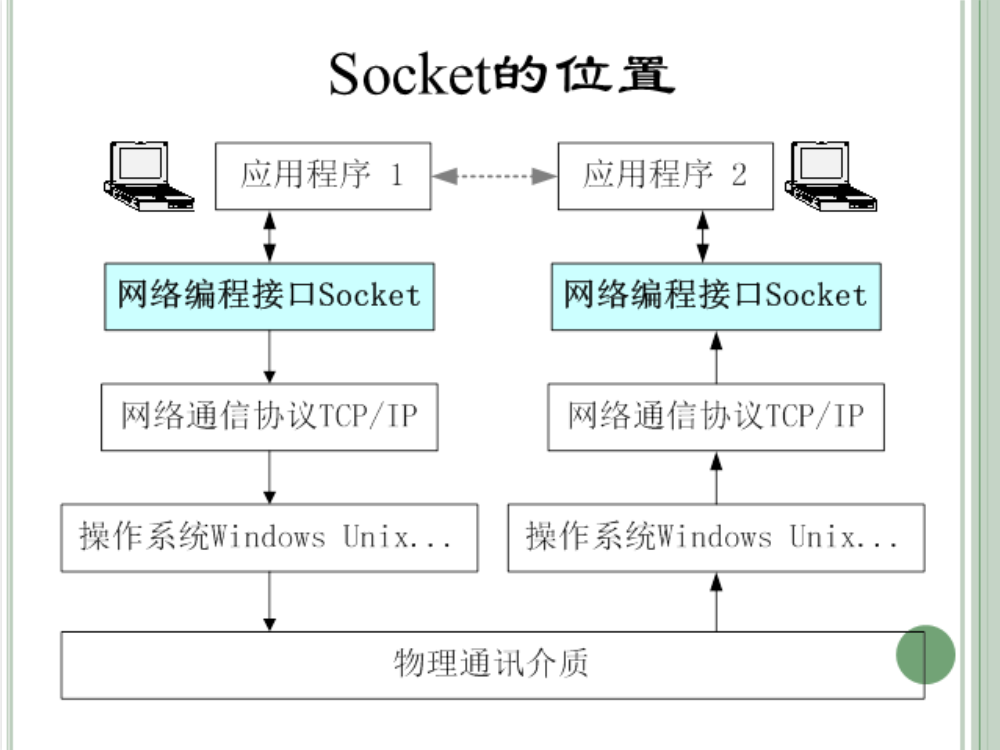
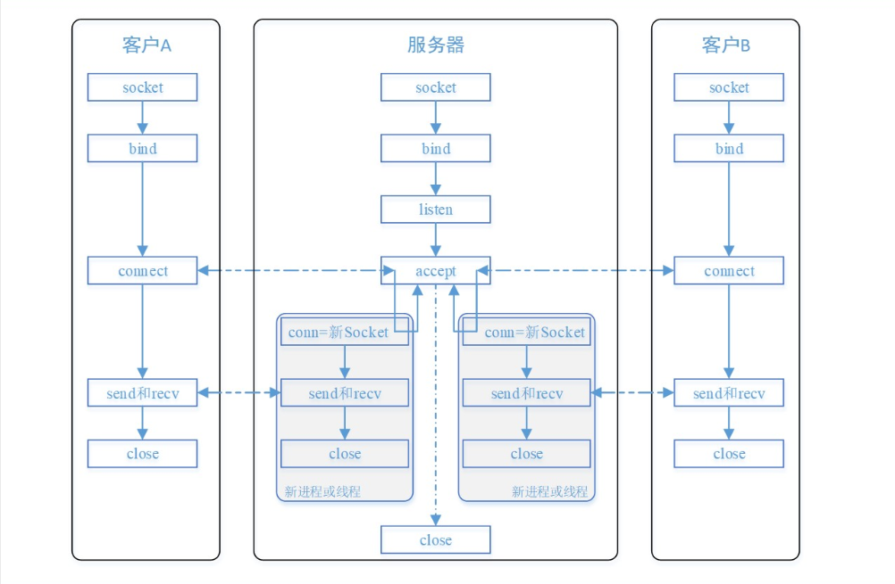
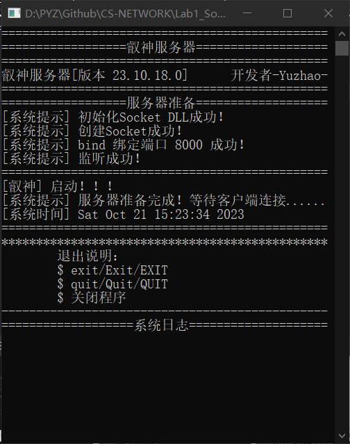
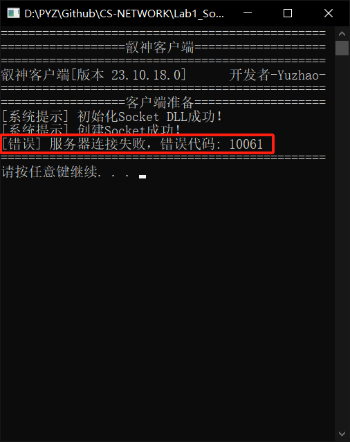
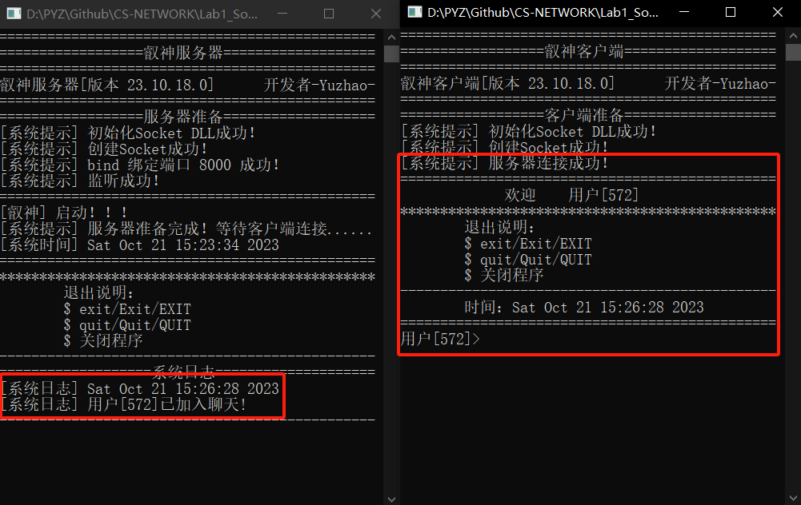
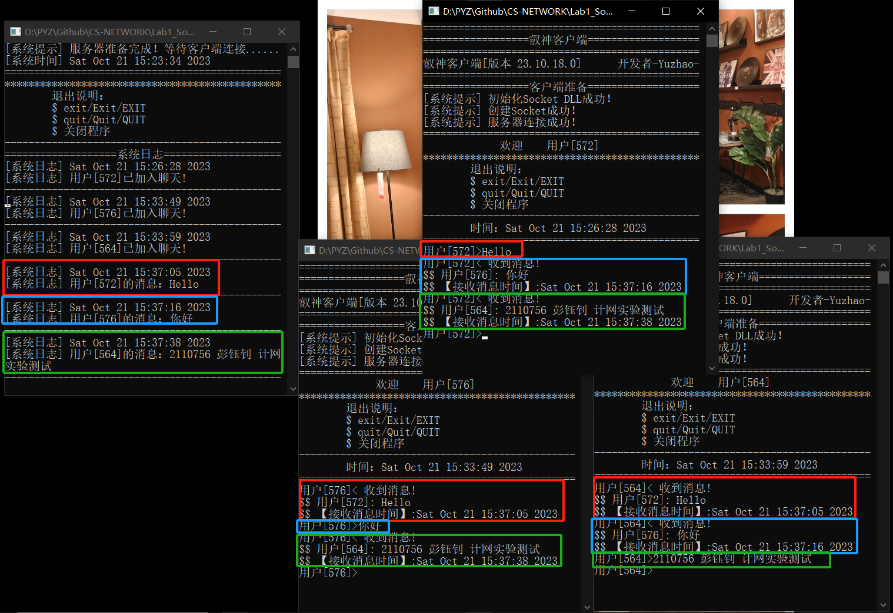
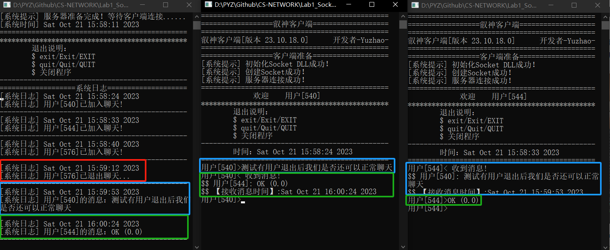
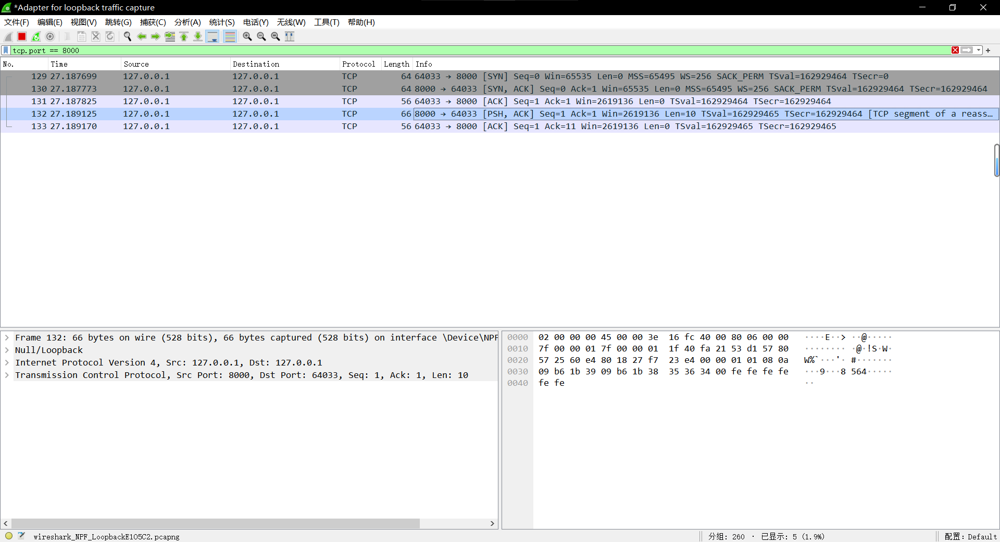
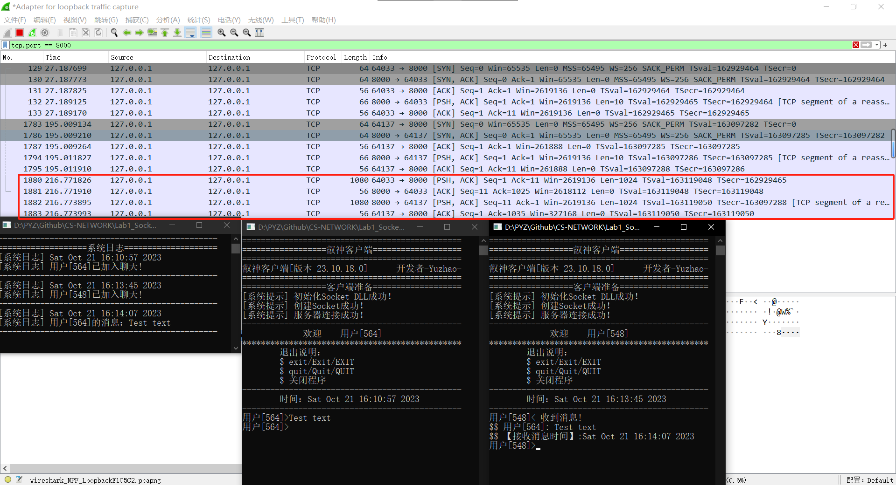
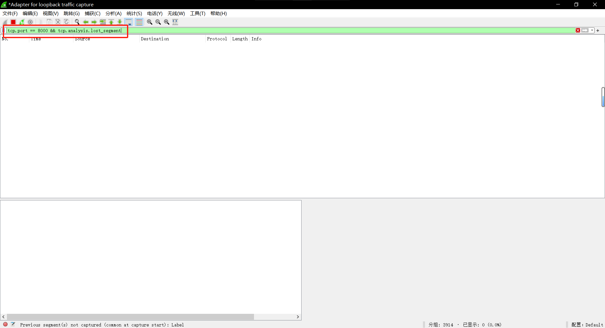

# <center>计算机网络课程实验报告</center>

## <center>Lab 1	Socket编程实践</center>

<center><b>姓名：彭钰钊 &nbsp&nbsp 学号：2110756 &nbsp&nbsp 专业：计算机科学与技术 </b></center>

## 一、前期准备

**本部分进行简单的前期工作准备——实验相关知识点整理。**

### （一）Socket简介

Socket，中文名称为**套接字**是一种操作系统提供的进程间通信机制[^ 1]，是支持TCP/IP的操作系统为网络程序开发提供的典型网络编程界面。进程通过Socket来发送和接收消息，其存在的位置如下图所示。

[^ 1]:引自维基百科：[网络套接字](https://zh.wikipedia.org/wiki/網路插座)



**套接字的分类**

- **数据报套接字（datagram sockets）**	使用UDP协议，支持主机之间的面向非连接、不可靠的数据传输。
- **流式套接字（stream sockets）**	使用TCP协议，支持主机之间面向连接的、顺序的、可靠的、全双工字节流传输。

> **关于连接和非连接的通俗解释**
>
> 面向连接就是在正式通信前必须要与对方建立起连接。比如你给别人打电话，必须等线路接通了、对方拿起话筒才能相互通话。
>
> 面向非连接就是在正式通信前不必与对方先建立连接，不管对方状态就直接发送。这与现在风行的手机短信非常相似：你在发短信的时候，只需要输入对方手机号就OK了。 
>
> （引自：[面向连接和无连接协议 - 知乎](https://zhuanlan.zhihu.com/p/74374479)）

### （二）协议简介

**协议（protocol）**	定义了在两个或多个通信实体之间交换的报文的格式和顺序，以及报文发送和/或接收一条报文或其他实践所采取的动作。[^ 2]

[^ 2]:引自《计算机网络：自顶向下方法》（原书第7版）	James E. Kurose & Keith W. Ross

在计算机网络中，各个实体之间的数据交换需要遵循一些事先约定好的规则。那么所谓“**协议**”，就是双方共同遵守的事先约定的规则。协议有语法、语义、时序三要素：
（1）**语法**，即数据与控制信息的结构或格式；
（2）**语义**，即需要发出何种控制信息，完成何种动作以及做出何种响应；
（3）**时序**，即事件实现顺序的详细说明；

### （三）实验要求

（1）给出你聊天协议的完整说明。

（2）利用C或C++语言，使用基本的Socket函数完成程序。不允许使用CSocket等封装后的类编写程序。

（3）使用流式套接字、采用多线程（或多进程）方式完成程序。

（4）程序应有基本的对话界面，但可以不是图形界面。程序应有正常的退出方式。

（5）完成的程序应能支持多人聊天，支持英文和中文聊天。

（6）编写的程序应该结构清晰，具有较好的可读性。

（7）在实验中观察是否有数据的丢失，提交源码和实验报告。

**关于其他更加详细的内容在实验过程中进行补充说明。**

## 二、协议设计

**程序设计协议**

本程序实现——多人聊天室

- 采用流式套接字编程界面和TCP传输协议，使用多线程实现多人聊天。
- 程序包括两个部分——服务器端和客户端，约定只有当服务器端准备完成并且在线时，客户端才可以与之相连，否则连接失败。
- 服务器端支持与多个客户端进行连接：
  - 服务器端为每一刻客户端分配一个线程，并且创建新的Socket与客户端通信，同时在服务器端日志中记录用户登录信息：用户身份以及登录时；
  - 服务器端的线程处理函数中负责接收客户端消息，并将用户身份、消息内容以及服务器接收到消息的时间打印到服务器端日志中；
  - 服务器端的线程处理函数中处理消息转发；
  - 服务器端可以实时监测客户端是否断开连接，当客户端断开连接时，及时释放与该客户端连接的资源。
- 服务器端通过一个单独的线程支持输入关闭：当输入**exit/Exit/EXIT/quit/Quit/QUIT**或**直接关闭程序**，断开连接，关闭服务器端程序。
- 客户端支持两个线程：
  - 主线程负责键入发送消息内容并且将消息发送给服务器端；
  - 接收消息线程负责接收服务器端转发的消息，并打印输出。

**用户登录协议**

- 用户连接服务器后即登录。
- 在用户连接时用户从服务器获得用户ID编号作为用户身份标识。

**用户消息协议**

- 用户可以向服务器发送消息，消息文本支持中文和英文文本。
- 服务器可以将接收到的用户消息转发给除发送用户外的其他在线用户（与服务器端相连接的其他客户端），实现聊天功能。

**用户离线协议**

- 当用户希望退出程序时，可以输入**exit/Exit/EXIT/quit/Quit/QUIT**或**直接关闭程序**，断开连接，关闭客户端程序结束聊天。

## 三、功能模块实现与分析

我们本次实验要实现流式套接字、TCP协议传输的多人聊天室功能，具体有两个部分组成——服务器端、客户端，接下来我们就这两个部分进行说明：

### （一）总体程序编程步骤



图片来源[^ 3]

[^ 3]:引自 02-计算机网络-第二章-2022（第一部分）-20230917-带问题

**服务器端**

1. **WSAstartup**	初始化Socket DLL，协商Socket使用版本
2. **scoket**	创建一个Socket
3. **bind**	将一个本地地址绑定到指定的Socket
4. **listen**	使服务器端Socket进入监听状态，监听远程连接是否到来
5. **while (isServerRunning)**
   - **accept**	接受一个特定的Socket连接请求
   - **CreateThread**	为每一个客户端连接创建线程，每一个线程调用线程处理函数**handlerRequest**
6. **handlerRequest**
   - **send**	发送用户ID到客户端
   - **do-while**	循环处理客户端
     - **recv**	从客户端接收消息：如果返回正常则将消息转发给其他客户端；否则，表明客户端退出，则在日志中输出相关提示
     - **send**	服务器端将消息进行转发
     - **closesocket**	关闭该线程中创建的Socket
7. **closescoket**	关闭服务器端Socket
8. **WSACleanup**	结束使用Socket，释放Socket DLL资源

**客户端**

1. **WSAstartup**	初始化Socket DLL，协商Socket使用版本
2. **scoket**	创建一个Socket
3. **connect**	向服务端发送建连请求
4. **CreateThread**	创建一个接收线程
   - **recv**	接收服务器转发的消息
5. **while (true)**	接收用户键入消息，并使用**send**发送到服务器端。
6. **closescoket**	关闭客户端Socket
7. **WSACleanup**	结束使用Socket，释放Socket DLL资源

### （二）服务器端

在本模块中共有三类线程——主线程、接收键入线程、接受并转发线程，具体代码实现如下：

**宏、全局变量、函数声明**

```c++
#define PORT 8000  // 监听端口
#define MaxBufSize 1024  // 最大缓冲区大小
time_t t;
char time_str[64];
// 用户状态
map<SOCKET, int> user_map;  // 其中的int如果为1则为在线
SOCKET sockSrv;
bool isServerRunning = true;
// 线程处理函数声明
DWORD WINAPI handlerRequest(LPVOID lparam);
// 退出处理线程函数
void ServerInputThread();
```

**main函数**

本部分中实现了我们在上一部分中所说的基本编程流程，关于每一部分具体实现在代码中已做出详细注释：

```c++
int main()
{
	cout << "===============================================" << endl;
	cout << "==================叡神服务器===================" << endl;
	cout << "===============================================" << endl;
	cout << "叡神服务器[版本 23.10.18.0]      开发者-Yuzhao-" << endl;
	cout << "===============================================" << endl;
	cout << "==================服务器准备===================" << endl;
	//========================初始化Socket DLL=========================
	WORD wVersionRequested = MAKEWORD(2, 2);  // 版本请求：MAKEWORD(次版本号, 主版本号)
	WSAData wsadata;  // 套接字实现的详细信息
	int err = WSAStartup(wVersionRequested, &wsadata);  // err是WSAStartup函数的返回值——错误代码
	if (err != NO_ERROR) {
		cout << "[错误] 初始化Socket DLL失败，错误代码: " << WSAGetLastError() << endl;
		cout << "===============================================" << endl;
		system("pause");
		return 1;
	}
	cout << "[系统提示] 初始化Socket DLL成功！" << endl;
	//============================创建Socket===========================
	sockSrv = socket(AF_INET, SOCK_STREAM, IPPROTO_TCP);  // 本次实验采用Internet协议版本4（IPv4）地址族、流式套接字以及TCP协议
	if (sockSrv == INVALID_SOCKET) {
		cout << "[错误] 创建Socket失败，错误代码: " << WSAGetLastError() << endl;
		cout << "===============================================" << endl;
		WSACleanup();  // 释放 Socket DLL 资源
		system("pause");
		return 1;
	}
	cout << "[系统提示] 创建Socket成功！" << endl;
	//===================初始化服务器地址·bind（绑定）=================
	SOCKADDR_IN serverAddr;  // 服务端地址信息的数据结构IPv4
	serverAddr.sin_family = AF_INET;  // 协议族，IPv4地址族
	inet_pton(AF_INET, "127.0.0.1", &serverAddr.sin_addr.s_addr);  // 地址
	serverAddr.sin_port = htons(PORT);  // 端口号
	err = bind(sockSrv, (SOCKADDR*)&serverAddr, sizeof(serverAddr));
	if (err == SOCKET_ERROR) {
		cout << "[错误] bind 绑定失败，错误代码: " << WSAGetLastError() << endl;
		cout << "===============================================" << endl;
		closesocket(sockSrv);
		WSACleanup();
		system("pause");
		return 1;
	}
	cout << "[系统提示] bind 绑定端口 " << PORT << " 成功！" << endl;
	//============================监听 listen==========================
	err = listen(sockSrv, SOMAXCONN); // 最大监听队列长度为SOMAXCONN
	if (err == SOCKET_ERROR)
	{
		cout << "[错误] 监听失败，错误代码: " << WSAGetLastError() << endl;
		cout << "===============================================" << endl;
		system("pause");
		return 1;
	}
	cout << "[系统提示] 监听成功！" << endl;
	// 输出服务器准备完成提示
	cout << "===============================================" << endl;
	// 获取时间
	t = time(NULL);
	ctime_s(time_str, sizeof(time_str), &t);
	cout << "[叡神] 启动！！！" << endl;
	cout << "[系统提示] 服务器准备完成！等待客户端连接......" << endl;
	cout << "[系统时间] " << time_str;
	cout << "===============================================" << endl;
	thread inputThread(ServerInputThread);
	cout << "***********************************************" << endl;
	cout << "        退出说明：" << endl;
	cout << "        $ exit/Exit/EXIT" << endl;
	cout << "        $ quit/Quit/QUIT" << endl;
	cout << "        $ 关闭程序" << endl;
	cout << "-----------------------------------------------" << endl;
	cout << "===================系统日志====================" << endl;
	//============================处理Client===========================
	while (isServerRunning) {
		SOCKADDR_IN clientAddr;
		int len = sizeof(SOCKADDR);
		// 接收函数accept()
		SOCKET sockAccept = accept(sockSrv, (SOCKADDR*)&clientAddr, &len);
		if (!isServerRunning) {
			// Exit command received, don't accept new connections
			break;
		}
		if (sockAccept == INVALID_SOCKET) {
			cout << "[错误] accept 失败，错误代码: " << WSAGetLastError() << endl;
			cout << "===============================================" << endl;
			closesocket(sockSrv);
			WSACleanup();
			system("pause");
			return 1;
		}
		else {
			// 获取时间
			t = time(NULL);
			ctime_s(time_str, sizeof(time_str), &t);
			// 将Socket转为字符串作为用户ID
			char user_id[10];
			strcpy_s(user_id, to_string(sockAccept).data());
			cout << "[系统日志] " << time_str;
			cout << "[系统日志] 用户[" << user_id << "]已加入聊天!" << endl;
			cout << "-----------------------------------------------" << endl;
			// 创建线程处理Client
			HANDLE hThread = CreateThread(NULL, NULL, handlerRequest, LPVOID(sockAccept), 0, NULL);
			// 关闭线程引用
			CloseHandle(hThread);
		}
	}

	inputThread.join(); // 等待输入线程
	//============================关闭Socket===========================
	closesocket(sockSrv);  // 【真的不想写错误处理函数了（多半不会出现）】
	WSACleanup();
	return 0;
}
```

**退出处理**

我们通过一个线程来支持输入退出的功能，具体函数如下：

```C++
// 退出处理线程函数
void ServerInputThread() {
	string input;
	while (isServerRunning) {
		getline(cin, input);
		if (input == "exit" || input == "Exit" || input == "EXIT" 
			|| input == "quit" || input == "Quit" || input == "QUIT")
		{  // 退出判断
			isServerRunning = false;
			closesocket(sockSrv); // 关闭服务器socket
			break;
		}
	}
}
```

在main函数中`thread inputThread(ServerInputThread);`调用该线程函数。

**handlerRequest函数**

```c++
// 线程处理函数
DWORD WINAPI handlerRequest(LPVOID lparam)
{
	SOCKET ClientSocket = (SOCKET)lparam;
	user_map[ClientSocket] = 1;  // 置1，为在线
	char RecvBuf[MaxBufSize];  // 接收消息的缓冲区
	char SendBuf[MaxBufSize];  // 发送消息的缓冲区
	// 将Socket转为字符串作为用户ID
	char user_id[10];
	strcpy_s(user_id, to_string(ClientSocket).data());

	//=============================发送 send===========================
	send(ClientSocket, user_id, 10, 0);

	// 循环接受客户端数据
	int recvResult;
	int sendResult;
	//==============================循环处理===========================
	do {
		// 接收 recv
		recvResult = recv(ClientSocket, RecvBuf, MaxBufSize, 0);
		if (recvResult > 0) {
			strcpy_s(SendBuf, "用户[");
			string ClientID = to_string(ClientSocket);
			strcat_s(SendBuf, ClientID.data());
			strcat_s(SendBuf, "]: ");
			strcat_s(SendBuf, RecvBuf);

			// 获取时间
			t = time(NULL);
			ctime_s(time_str, sizeof(time_str), &t);
			cout << "[系统日志] " << time_str;
			cout << "[系统日志] 用户[" << ClientID << "]的消息：" << RecvBuf << endl;
			cout << "-----------------------------------------------" << endl;
			for (auto it : user_map) {
				if (it.first != ClientSocket && it.second == 1) {
					sendResult = send(it.first, SendBuf, MaxBufSize, 0);
					if (sendResult == SOCKET_ERROR) {
						cout << "[错误] 信息发送失败，错误代码: " << WSAGetLastError() << endl;
						cout << "-----------------------------------------------" << endl;
					}
				}
			}
		}
	} while (recvResult != SOCKET_ERROR);

	// 获取时间
	t = time(NULL);
	ctime_s(time_str, sizeof(time_str), &t);
	// 获取用户ID
	string ClientID = to_string(ClientSocket);
    user_map[ClientSocket] = 0;
	cout << "[系统日志] " << time_str;
	cout << "[系统日志] 用户[" << ClientID << "]已退出聊天..." << endl;
	cout << "-----------------------------------------------" << endl;
	closesocket(ClientSocket);
	return 0;
}
```

### （三）客户端

**接收消息线程**

```c++
// 接收消息的进程处理函数
DWORD WINAPI recvThread()
{
	while (1)
	{
		char RecvBuf[MaxBufSize];  // 接收消息的缓冲区
		int recvResult = recv(clientSocket, RecvBuf, sizeof(RecvBuf), 0);
		if (recvResult > 0)
		{
			cout << "\r";
			cout << "用户[" << user_id << "]<" << " 收到消息! " << endl;
			cout << "$$ " << RecvBuf << endl;
			// 获取时间
			t = time(NULL);
			ctime_s(time_str, sizeof(time_str), &t);
			cout << "$$ 【接收消息时间】:" << time_str;
			cout << "用户[" << user_id << "]>";
		}
		else if (recvResult < 0)  // 断开连接
		{
			cout << "[警告] 断开连接..." << endl;
			cout << "或许是服务器端程序出现了什么问题？" << endl;
			break;
		}
	}
	return 0;
}
```

**main函数**

由于与服务器端重复率较高，因此只在这里展示不同的代码：

```c++
//===========================连接 connect==========================
	err = connect(clientSocket, (SOCKADDR*)&serverAddr, sizeof(SOCKADDR));
	if (err == SOCKET_ERROR) {
		cout << "[错误] 服务器连接失败，错误代码: " << WSAGetLastError() << endl;
		cout << "===============================================" << endl;
		system("pause");
		return 1;
	}
	cout << "[系统提示] 服务器连接成功！" << endl;
```

```C++
//==============================主线程=============================
	while (true) {
		cout << "用户[" << user_id << "]>";
		char buf[MaxBufSize];
		cin.getline(buf, sizeof(buf));
		if (strcmp(buf, "exit") == 0 || strcmp(buf, "Exit") == 0 || strcmp(buf, "EXIT") == 0
			|| strcmp(buf, "quit") == 0 || strcmp(buf, "Quit") == 0 || strcmp(buf, "QUIT") == 0)
		{  // 退出判断
			break;
		}
		// 发送
		send(clientSocket, buf, sizeof(buf), 0);
	}
```

## 四、程序运行演示

**服务器端准备演示**



我们在程序界面输出服务器端准备信息，并给出程序退出说明提示，如上图所示。

**用户加入测试**

- 未打开服务器端应用：



当我们未打开服务器端应用程序时，我们打开客户端连接失败，界面上输出错误提示信息。

- 打开服务器端应用：



如上图所示，我们首先打开服务器端应用，然后打开一个客户端程序，在客户端程序界面将会打印连接成功提示，并输出欢迎信息以及退出说明，同时在底层逻辑上将会从服务器端获得用户ID；在服务器端程序中将会输出客户端加入聊天的信息，同时记录服务器端连接成功的时间。

**用户聊天测试**

本次实验我们需要支持多人聊天，为了测试这个功能我们打开三个客户端应用程序，如下图所示：



我们可以看见用户可以发送中、英文消息，并且服务器端能够实现正确的转发，即能够实现正常的聊天功能。

**用户退出测试**



我们对于第三个客户端输入exit可以使之退出，可以看见我们在服务器端输出了提示信息，对于其他客户端并不影响正常聊天，如上图所示。

## 五、数据分析

我们从上面的程序运行演示中并未发现明显的数据丢失，我们再尝试使用Wireshark抓包分析，我们定义服务器端的端口为8000，因此使用显示过滤器tcp.post == 8000，对其进行抓包。

我们打开服务器端程序，然后再打开一个客户端程序，抓包情况如下：



显然这里传输了一个长度为10的数据包，而这正是我们定义的用户ID的长度，在客户端与服务器端建连时由服务器端发给客户端，数据没有发生丢失。



如上图所示，我们使用一个客户端发送信息，抓包结果中可以看见一个客户端向服务器端发送了一个长度为1024的数据包，而服务器端向另一个客户端发送了一个长度为1024的数据包。这实际上就是我们的聊天过程——客户端向服务器端发送消息，服务器向其他在线客户端转发。至于为何是否有数据丢失，我们从代码中可以知道1024是我们定义的消息缓冲区大小，因此显然数据没有发生丢失。



我们再利用显示过滤器tcp.port == 8000 && tcp.analysis.lost_segment，可以发现没有相关信息，也就是说在本次实验中我们没有发现数据丢失。

