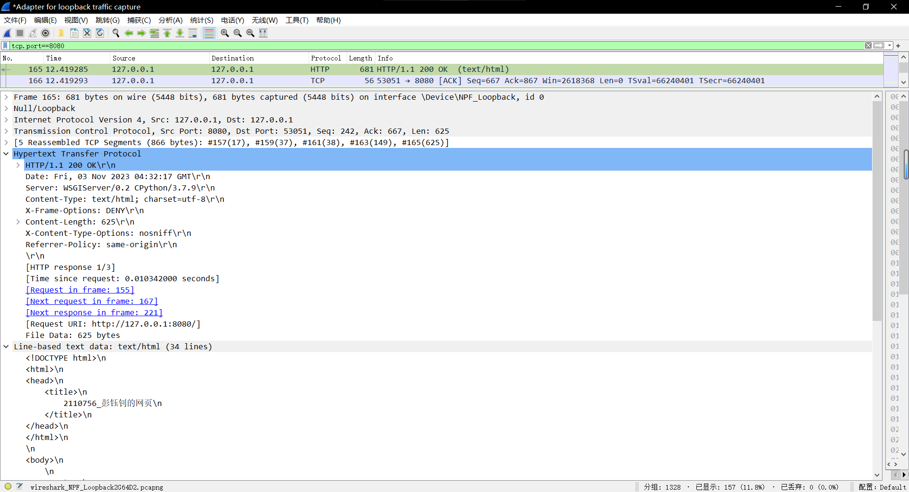
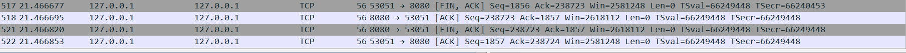

# <center>计算机网络课程实验报告</center>

## <center>Lab 2	配置Web服务器，编写简单页面，分析交互过程</center>

<center><b>姓名：彭钰钊 &nbsp&nbsp 学号：2110756 &nbsp&nbsp 专业：计算机科学与技术 </b></center>

## 一、前期准备

从实验标题上即可看出我们本次实验的主要任务分为三个部分，其实重点在于**分析交互过程**，但还是需要前两个步骤，那么我们依次完成。

### （一）配置Web服务器

配置Web服务器的方法上网可以搜到不少，这真的是实力劝退小白本白，事实上我们这一次实验仅仅部署一个本地服务器即可，并且没有限制系统、语言以及框架，那么让我找回资料重操Django。

**Django简介**

Django 是一个由 Python 编写的开放源代码的 Web 应用程序开发框架。它采用了 MVT 软件设计模式，即 Model 模型、View 视图和 Templates 模板。

**其他框架简介**

- Flask 很轻量，可以迅速搭建一个简单的 Web 网站。几乎没有组件限制，提供大量功能丰富且实用的插件，例如 Flask-Admin 后台管理插件、Flask-WTForm 表单管理插件、Flask-Login     登录功能插件、Flask-Migrate     数据表版本控制插件等。著名的科学网站果壳网就是使用 Flask 开发的。
- Tornado 性能较高，支持异步处理，这是它最大的亮点。对 Restful API 设计良好，但没有针对数据库设计的优秀的 ORM 模块，这是比较麻烦的。
- Bottle 更加轻量，只依赖于 Python 标准库，无法做到快速建站，在 Flask 面前几乎没有优势可言。
- Aiohttp 是比较新的框架，它需要基于 asyncio 编写异步代码，性能方面不必担心，但框架完善还需要较长时间。

其实对于我们本次实验来说Flask足以支撑，但是相较于重操旧业来说，白手起家的成本还是要高一点的，因此我仍然选择Django。

### （二）编写简单网页

这一部分没有太多需要做的前期准备，主要是编写一个包含文本、图片以及音频的网页，即html文件。

### （三）分析交互过程

这一部分主要是wireshark的使用，我在网上搜索得到一些参考资料：

[【网络】抓包工具Wireshark下载安装和基本使用教程_wireshark安装教程-CSDN博客](https://blog.csdn.net/qq_35995514/article/details/133580865)

[超详细的 Wireshark 使用教程 - 知乎 (zhihu.com)](https://zhuanlan.zhihu.com/p/631821119)

Wireshark的抓包界面主要分为三个面板：**数据包列表（Packet List）面板**、**数据包详情（Packet Details）面板**、**数据包字节（Packet Bytes）面板**，分别是捕获到的数据包、以层次结构显示数据包详情、以十六进制和ASCII编码显示的数据包原始字节。

对于**数据包列表面板**又分为以下层次：

- ***Frame***	物理层数据帧概况
- ***链路层***——这一部分显示因情况而不同
- ***Internet Protocol Version 4***	互联网层IP包头部信息
- ***Transmission Control Protocol***	 传输层的数据段头部信息，我们本次实验使用的是TCP
- ***Hypertext Transfer Protocol***	 应用层的信息，本次实验是HTTP协议

此外，主要是**TCP协议**的相关知识，本部分不再做理论叙述，具体将结合实验结果进行分析。

[TCP协议详解 - 知乎 (zhihu.com)](https://zhuanlan.zhihu.com/p/64155705)

## 二、实验细节

**本部分主要针对实验的前两个任务**

**配置Web服务器**

在这里前期的环境准备我就不做过多的赘述了，简单地说就是配置了python的虚拟环境【目的是保证本机的整洁】，在虚拟环境容器中安装Django。

在我们的虚拟环境容器中`Scripts`文件夹下打开命令行，启动虚拟环境（输入命令`activate.bat`），然后选择适合的地方初始化Django项目：

```shell
django-admin startproject myweb
```

然后进入`myweb`文件夹创建应用目录：

```shell
python manage.py startapp Lab2
```

紧接着注册应用，项目主目录 `myweb` 下的 `myweb/settings.py` 文件，修改 INSTALLED_APPS 项，即添加`Lab2`；并调整路由，修改其中的 ALLOWED_HOSTS 项，将其赋值为`["*",]`。设置启动端口为8080并启动项目：

```shell
python manage.py runserver 0.0.0.0:8080
```

如果遇到问题则按照提示信息操作。在浏览器中输入：http://127.0.0.1:8080，启动项目后，打开启动 **Web** **服务** 即可呈现 Django 的欢迎页。到此我们服务器配置初始工作完成，接下来需要编写简单网页的html文件，并将其配置到服务器上。

**编写简单网页**

首先编写的就是Django框架中的视图函数，打开 `Lab2/views.py` 文件进行编写：

```python
from django.shortcuts import render
from django.http import HttpResponse  # 请求和响应API

# Create your views here.
def index(request,methods = ['GET','POST']):
    return render(request, 'index.html')
```

然后再应用文件夹(`Lab2`)下创建模板文件夹(`templates`)并在其中添加模板文件，即我们的简单网页`index.html`：

```python
<!DOCTYPE html>
<html>
<head>
    <title>
        2110756_彭钰钊的网页
    </title>
</head>
</html>

<body>
      # 用于添加资源
    <center>
    <h1>
        Lab2 超简单网页
    </h1>
    <p>
        <b>姓名：</b>彭钰钊
    </p>
    <p>
        <b>学号：</b>2110756
    </p>
    <p>
        <b>专业：</b>计算机科学与技术
    </p>
    
    
    <p>
        <b>👆 LOGO & 音频 👇</b>
    </p>
    <audio controls="controls">
        <source src="" type="audio/mp3"></source>
    </audio>
    </center>
</body>
```

注意在`myweb\myweb\urls.py`中进行修改，如注释所示：

```python
from django.contrib import admin
from django.urls import path
from Lab2.views import index   # 引入视图函数

urlpatterns = [
    path('admin/', admin.site.urls),
    path('', index),  # 添加我们的主页路径
]
```

为了[添加图片和音频资源](https://blog.csdn.net/weixin_41529093/article/details/115653070)，修改`myweb/settings.py` 文件：

```python
import os
# 添加资源
STATIC_URL = '/static/'
STATICFILES_DIRS=(
    os.path.join(BASE_DIR,'static'),
)
```

到目前位置我们就已经做好了交互前的准备工作。

## 三、交互过程分析

**本部分针对实验的第三个任务**

接下来是本次实验的**重点**——交互过程分析，实际上是对于**TCP协议**的一个分析。首先，我们打开**Web服务器**：


即输入如下命令指定端口8080启动服务器：

```shell
python manage.py runserver 0.0.0.0:8080
```

通过浏览器**Microsoft Edge**打开我们的网页，url为http://127.0.0.1:8080，网页界面如下所示：


**Wireshark抓包分析**

- 打开***Wireshark***，选择***Adapter for loopback traffic capture***【这是由于我们建立的是本地服务器，并且使用的是本地浏览器访问】

- 设置过滤器：`tcp src or dst port 8080`【这是由于我们启动的服务器端口号为8080】
- 过滤抓包，由于资源文件较大，因此截取关键抓包结果截图部分如下（这里我们使用的是显示过滤器：`tcp.port==8080`，我们提交的抓包文件所用的是上面所说的过滤器）：


<center>图一</center>


<center>图二</center>


<center>图三</center>

以上是实验流程的简单概述，接下来我们就抓包结果进行具体分析。

### （一）TCP报文段格式

> 参考：[TCP报文各字段格式详解 - 知乎 (zhihu.com)](https://zhuanlan.zhihu.com/p/431583008#:~:text=1 源端口 ，16bits，范围0~65525。 2 目的端口 ，16bits，范围同上。 3 sequence,URG%3D1 时，表明紧急指针字段有效。 ... 8 窗口大小 ，16bits，窗口字段用来控制对方发送的数据量，单位为字节。 ... 更多项目)


- **源端口号**	发送方的TCP端口号，16bits
- **目的端口号**	接收方的TCP端口号，16bits
- **发送序号**	数据部分第一个字节的序列号，32bits
- **确认序号**	期望接收的下一个报文段的数据的第一个字节的序列号，32bits
- **头长度**	指出报文数据距TCP报头的起始处有多远(TCP报文头长度)，4bits
- **未用**	目前置零，6bits【事实上后两位用于显式拥塞通知】
- **标志位**
  - **U（URG）**：紧急比特，1bit；当 URG=1 时，表明紧急指针字段有效。它告诉系统此报文段中有紧急数据，应尽快传送(相当于高优先级的数据)。
  - **A（ACK）**：确认比特，1bit；只有当 ACK=1时确认号字段才有，当 ACK=0 时，确认号无效。
  - **P（PSH）**：推送比特，1bit；接收方 TCP 收到推送比特置1的报文段，就尽快地交付给接收应用进程，而不再等到整个缓存都填满了后再向上交付。
  - **R（RST）**：复位比特，1bit；当RST=1时，表明TCP连接中出现严重差错(如由于主机崩溃或其他原因)，必须释放连接，然后再重新建立运输连接。
  - **S（SYN）**：同步比特，1bit；同步比特 SYN 置为 1，就表示这是一个连接请求或连接接受报文。
  - **F（FIN）**：终止比特，1bit；用来释放一个连接。当FIN=1 时，表明此报文段的发送端的数据已发送完毕，并要求释放运输连接。
- **接收窗口通告**	窗口字段用来控制对方发送的数据量，单位为字节。TCP 连接的一端根据设置的缓存空间大小确定自己的接收窗口大小，然后通知对方以确定对方的发送窗口的上限，16bits
- **校验和**	校验和字段检验的范围包括首部、数据以及伪头部这三部分。在计算校验和时，要在 TCP 报文段的前面加上 12 字节的伪首部，16bits
- **紧急数据指针字**	紧急指针指出在本报文段中的紧急数据的最后一个字节的序号，仅当 URG=1 时有效，16bits
- **选项字段**	长度可变，包括窗口缩放选项、MSS、时间戳等
- **数据**	应用层进程提交的数据

### （二）三次握手

TCP协议是面向连接的（connection-oriented），是因为在一个应用进程向另一个应用进程发送数据之前，这两个进程必须先进行相互“握手”，即它们必须**相互发送某些预备报文段**，以建立确保数据传输的参数。

我们熟知的**三次握手**就是TCP建立连接的过程中客户端和服务器端之间交换的三个TCP报文段，主要目的是：

- 确认存在：即客户端和服务器端知晓对方已在线
- 协商参数：即保证数据传输的一些参数
- 分配资源：即分配实体资源保证数据传输

在这里对两个概念进行说明：

- **客户端**	主动发起TCP建连请求的应用进程
- **服务器端**	被动接收TCP建连请求的应用进程

示意图如下所示：


**抓包结果对应：**


具体分析如下

**1.第一次握手**


在建立连接请求之前，客户端与服务器端均处于关闭状态——CLOSED。

我们根据数据包详情可以知道以下信息：

- 源端口号：53051

- 目的端口号：8080

- 相对发送序列号：0

  实际发送序列号：2355241419

- 标志位：SYN=1

显然这是由**客户端**（53051）主动申请与服务器（8080）端建连，向服务器端发送的**连接请求报文段**，此时相对发送序列号为0，表示客户端的初次发送，事实上发送序列号是随机生成的一个值，依赖于具体实现。在这个过程中将SYN（同步标志位）置为1，根据TCP协议规定不携带数据。随后客户端进入**SYN-SENT**状态，等待服务器的确认，此时服务器端处于**LISTEN**状态。

**2.第二次握手**


我们根据数据包详情可以知道以下信息：

- 源端口号：8080

- 目的端口号：53051

- 相对发送序列号：0

  实际发送序列号：4253912501

- 相对确认序列号：1

  实际确认序列号：2355241420

- 标志位：SYN=1，ACK=1

本次握手是由**服务器端**（8080）向客户端（53051）发送的**确认报文段**，此时相对发送序列号为0，表示服务器端的初次发送。***值得注意的是，这里虽然与第一次握手的相对发送序列号相同（都是0），但是其代表的实际序列号并不相同——2355211419（第一次）、4253912501（第二次）。***在这个过程中服务器端本次连接分配实体资源，并将SYN（同步标志位）和ACK（确认标志位）均置为1，根据我们的理论分析，此时的确认序列号应当为x+1（x是客户端第一次的发送序列号），那么也得到了验证——2355241420=2355211419+1表示对客户端选择的初始序列号的确认。随后服务器端进入**SYN-RCVD**状态。

**3.第三次握手**


我们根据数据包详情可以知道以下信息：

- 源端口号：53051

- 目的端口号：8080

- 相对发送序列号：1

  实际发送序列号：2355241420

- 相对确认序列号：1

  实际确认序列号：4253912502

- 标志位：ACK=1

本次握手是由**客户端（53051）**向服务器端（8080）发送的**确认报文段**——客户端收到来自服务器端的确认报文后，检查ack是否为x+1、ACK是否为1，如果正确则发出确认报文。此时相对发送序列号为1。

> *我们在这里稍微解释一下为什么是x+1，对于客户端而言，其发送的第一个报文端的seq为x，且不携带数据，那么第二个报文段的seq就应该是数据部分的第一个字节的序列号，即x+1。*

在这个过程中客户端本次连接分配实体资源，并将ACK（确认标志位）置为1，根据我们的理论分析，此时的确认序列号应当为y+1（y是服务器端第一次的发送序列号），那么也得到了验证——4253912502=4253912501+1，表示对服务器端选择的初始序列号的确认。随后客户端进入**ESTABLISHED**状态，服务器端接收到该数据包后检查ack是否为y+1，ACK是否为1，如果无误则建连成功，进入**ESTABLISHED**状态，完成三次握手，客户端和服务器端可以开始进行数据传输。

### （三）HTTP报文格式

> 参考：
>
> [HTTP 报文结构详解 - 知乎 (zhihu.com)](https://zhuanlan.zhihu.com/p/450128753)
>
> [HTTP报文格式详解-CSDN博客](https://blog.csdn.net/m0_45861545/article/details/120835738)

**HTTP报文**	HTTP 报文是在应用程序之间发送的数据块,这些数据块将通过以文本形式的元信息开头，用于 HTTP 协议交互。请求端(客户端)的 HTTP 报文叫做**请求报文**，响应端(服务器端)的叫做**响应报文**。

**1.请求报文**


- **请求行**

  - 方法字段：GET、POST、HEAD、PUT、DELETE等
  - URL字段：统一资源定位器，带有请求对象的标识，`<协议>://<主机>:<端口>/<路径>`
  - HTTP版本字段

- **首部行**

  即，常说的**请求头**，包含若干个属性，格式为“属性名:属性值”，服务端据此获取客户端的信息。与缓存相关的规则信息，均包含在 header 中，请求头可大致分为四种类型：通用首部字段、请求首部字段、响应首部字段、实体首部字段。

  

- **实体体**

  数据本身，可以是多种类型：图片、音频、视频等。

**2.响应报文**


- **状态行**

  - 协议版本字段

  - 状态码

    > 参考：[HTTP 状态码 | 菜鸟教程 (runoob.com)](https://www.runoob.com/http/http-status-codes.html)
    >
    > - 200 - 请求成功
    > - 206 -  服务器成功处理了部分GET请求
    > - 301 - 资源（网页等）被永久转移到其它URL
    > - 304 - 未修改。所请求的资源未修改，服务器返回此状态码时，不会返回任何资源。客户端通常会缓存访问过的资源，通过提供一个头信息指出客户端希望只返回在指定日期之后修改的资源
    > - 403 - 拒绝执行
    > - 404 - 请求的资源（网页等）不存在
    > - 500 - 内部服务器错误

    

  - 状态信息

- **首部行**

  即，响应头部

  

- **实体体**

  用于存放需要返回给客户端的数据信息。

一个典型的例子（来自课本）如下：


### （四）HTTP请求应答分析

本部分分析的**数据包列表**截图不再重复贴放，可参见交互过程分析中Wireshark抓包分析中的图1至图3。根据实验要求，我们编写简单网页中包含文本、图片和音频三种文件类型，因此我们在本次实验中会出现三轮HTTP请求应答，三轮的请求应答整体类似，我们以第一次为例进行分析：

**第一轮请求应答**

客户端向服务器端发送**HTTP请求报文**


- **请求行**
  - 方法字段：GET
  - URL：/
  - HTTP版本字段：HTTP/1.1
- **首部行**
  - Host：主机名——127.0.0.1:8080
  - Connection：keep-alive——客户端与服务器端的请求响应保持连接
  - sec-ch-ua：在以逗号分隔的列表中提供与浏览器关联的每个品牌的品牌和重要版本
  - Accpect：用户可以识别的类型列表
  - Accept-Encoding：客户可识别的数据编码
  - Accept-Language：浏览器支持的语言类型

关于请求报文的**TCP报文段标志位**分析：PSH、ACK

HTTP报文被分为多段，在使用TCP传输时，应用层会出于某些原因（超出MSS）使得一个报文段不能包含所有的协议数据单元（PDU），那么将会把一个完整的消息拆分为多段，每一段（除最有一段外）将会打上标签***TCP segment of a reassembled PDU***。

我们解释PSH的作用：当两个应用程序进行交互式的通信时,有时在一端的应用进程希望在键入一个命令后立即就能够收到对方的响应。在这种情况下,TCP可以使用推送(push)操作。这时,发送端TCP将推送比特PSH置为1,并立即创建一个报文段发送出去。

服务器端向客户端发送**HTTP响应报文**



- **状态行**

  - 协议版本字段：HTTP/1.1
  - 状态码：200
  - 状态信息：OK

- **首部行**

  - Content-Type：文件类型
  - Content-Length：消息长度
  - File-Data：响应报文大小

- **实体体**

  我们编写的html文档。

### （五）四次挥手

与TCP建连的”三次握手“相对应，TCP断开连接被称为**挥手**，这个过程需要在客户端和服务器端交互四个数据包，因此是**四次挥手**。

示意图如下所示：


**抓包结果对应：**



**1.第一次挥手**


客户端向服务器端发送**释放连接报文段**，主动关闭连接，将FIN（终止标志位）置为1，此时seq=u=2355243275，然后客户端进入 **FIN-WAIT1** 状态，停止发送数据，等待服务器端响应。

**2.第二次挥手**


服务器端回复**确认报文段**，将ACK（确认标志位）置为1，此时seq=v=4254151224，ack=2355243276（即u+1=2355243275+1），然后服务器端进入 **CLOSED-WAIT** 状态，这时从客户端到服务器端的连接已经释放，TCP连接处于半关闭状态，当客户端收到该报文段并确认后进入 **FIN-WAIT2** 状态。

**3.第三次挥手**


服务器端此时处于等待关闭的状态，其目的是再次确认数据是否传输完毕，当确认数据传输完毕后，发送**释放连接报文段**，将FIN（终止标志位）和ACK（确认标志位）置为1，此时seq=w=4254151224，ack=2355243276（即u+1=2355243275+1），然后服务器端进入 **LAST-ACK** 状态，等待客户端最后确认。

**4.第四次挥手**


客户端最后回复一个**确认报文段**，将ACK（确认标志位）置为1，此时seq=2355243276（即u+1=2355243275+1），ack=4254151225（即w+1=4254151224+1），最后客户端等待30s关闭连接。

## 四、其他问题

助教提问：**第四次挥手后为什么要经过TIME_WAIT状态之后才进入CLOSED状态，为什么不直接进入CLOSED状态？**

因为需要确保客户端最后发送第四次挥手的确认报文段数据包被服务器端接收，如果客户端发送的第四次挥手的确认报文段数据包服务端没有收到，那么服务端会重新发送第三次挥手的释放连接报文段数据包，此时客户端处于TIME_WAIT状态，就可以在收到后再次发送第四次挥手的ACK数据包。如果客户端直接关闭连接，将无法处理这种情况，而TIME_WAIT状态一般等待的是2MSL的时长。

**进一步探究——为什么TIME_WAIT状态的等待时长是2MSL？**

首先介绍什么是MSL，MSL（Maximum Segment Lifetime，“**报文最大生存时间**”）是任何报文在网络上存在的最长时间，超过这个时间报文将被丢弃。2MSL确保旧连接的数据包被完全丢弃，客户端能够完全重启，因为如果是1MSL的可能导致新的客户端如果使用了和上一个客户端完全相同的四元组，则会接收到旧有的数据包，比如前面所说的服务器重发的释放连接报文段数据包，同时这种情况意味着客户端的确认报文段数据包丢失，这会导致服务端内部错误造成RST。那么为什么不能是更长的时间？因为2MSL如果能够起到效果就没有必要造成不必要的时间浪费，如果不管用，可能是连续两次丢包，然而这种概率是极小的，在实际应用中效率为王，时间就是金钱，忽略这样的小概率事件才是性价比最高的！

