# <center>计算机网络课程实验报告</center>

## <center>Lab 3-1	基于UDP服务设计可靠传输协议并编程实现（3-1）</center>

<center><b>姓名：彭钰钊 &nbsp&nbsp 学号：2110756 &nbsp&nbsp 专业：计算机科学与技术 </b></center>

## 一、前期准备

### （一）UDP

UDP，全称为User Datagram Protocol，中文名是用户数据报协议，属于传输层协议，为进程间通信提供非连接的、**不可靠的**传输服务，实现复用分用、差错检测等传输层功能。其特点如下：

- 发送方和接收方不需要握手过程
- 每个 UDP数据单元【即数据报】独立传输
- 提供复用分用功能
- 支持组播通信
- 不提供可靠性保证：即无确认重传、可能存在出错、丢失、乱序等现象

**UDP数据报格式**

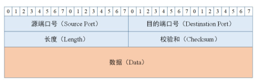

**UDP数据报差错检测 & 伪首部**

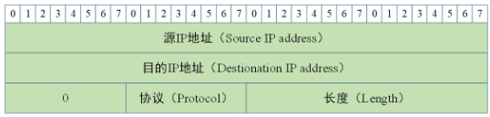

### （二）数据报套接字

> 基本编程参考：[计算机网络-应用层协议及网络编程](https://changjiang.yuketang.cn/v2/web/student-v3/14016437/997315381494818048/18356714)

对于数据报套接字而言，其应用程序编写框架如下：

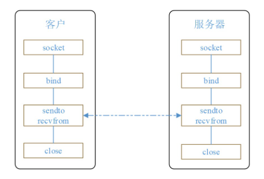

### （三）可靠数据传输

说到**可靠数据传输**我们首先想到的会是**TCP**，那么我们本次实验基于UDP协议的可靠数据传输就需要借鉴TCP的一些机制：建立连接、接收确认、超时重传等。

**接收确认**	当发送端的数据达到接收主机时，接收端主机会返回一个已收到消息的通知，这个消息叫做ACK(确认应答，Positive Acknowlegement)。

**序列号机制**	序列号是按照顺序给发送数据的每一个字节都标上号码的编号。接收端查询接收数据首部中的序列号和数据的长度，将自己下一步应该接受的序列号作为确认应答返送回去。

**超时重传**	超时重传的超时是指在重发数据之前，等待确认应答到来的那个特定时间间隔（发送端在发送数据报文之后会启动一个计时器记录时间）。如果超过了这个时间仍然为收到确认应答，发送端将会重发数据。

**停等机制**	每发送一帧数据后需要接收到对方的回复之后才发送下一帧数据。

## 二、协议设计

### （一）报文格式

我们设计数据报报文格式如下：

**首部**

- 源ip地址：4字节
- 目的ip地址：4字节
- 源端口号：2字节
- 目的端口号：2字节
- 发送序列号：4字节
- 确认序列号：4字节
- 数据大小：4字节
- 校验和：2字节
- 标志位：2字节

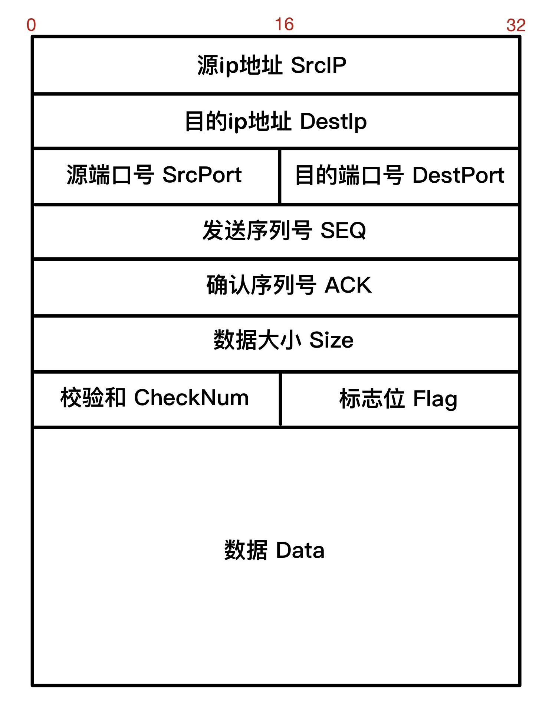

### （二）建立连接

我们实现可靠数据传输的第一个关键部分——建立连接，我们仿照TCP建连过程设计连接协议【三次握手】如下：

> 对于客户端和服务器端的概念做出简单解释，本次实验中均取此概念释义：
>
> - **客户端**	主动发起建连请求的应用进程，也称发送端
> - **服务器端**	被动接收建连请求的应用进程，也称接收端

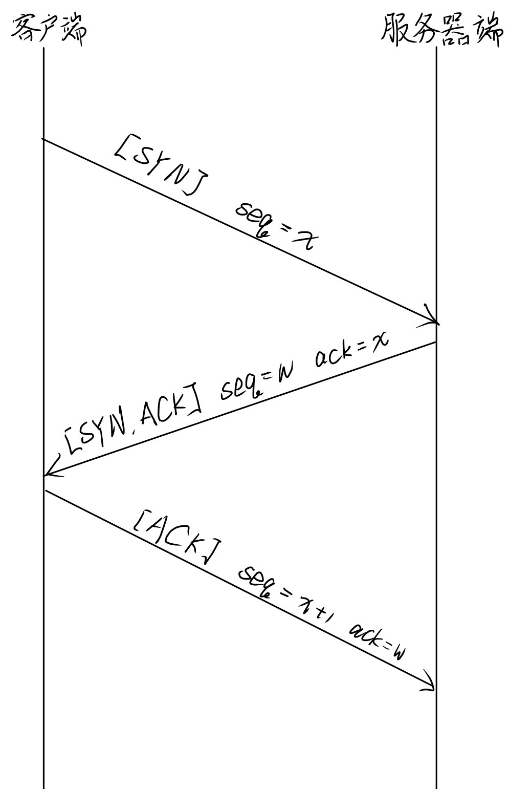

- 第一次握手：客户端$\to$服务器端

  - 标志位SYN置1：SYN=1
  - 发送序列号：seq=x

- 第二次握手：服务端$\to$客户端

  - 标志位SYN、ACK置1：SYN=1、ACK=1

  - 发送序列号：seq=w

  - 确认序列号：ack=x

    【在本次实验中我们对TCP的三次握手做出修改，确认序列号不设置为期待下一个接收的报文段序列号而是确认上一个发送的报文段序列号，后面的ack均采用此方式。】

- 第三次握手：客户端$\to$服务器端

  - 标志位ACK置1：ACK=1
  - 发送序列号：seq=x+1
  - 确认序列号：ack=w【上一个报文的发送序列号】

**建立连接过程中的超时重传**

对于第一次握手和第二次握手我们分别在报文的发送方设置计时器，当超过预设的最大等待时间后启用超时重传机制——即未收到对方的确认报文段，重传上一个报文段。

关于第三次握手重传问题在最后**探索**一小节中进行说明。

### （三）可靠数据传输

本次实验的数据传输主要分为两个部分：文件相关信息（文件名、文件大小）传输以及文件数据传输，为了实现可靠数据传输本次实验程序支持**差错检测**、**超时重传**，解决**丢失**、**失序**等问题。我们在传输过程时，如果文件较大将会被分为多个报文段进行传递，根据文件大小和**MMS**可以得到两种报文段：

- 满载报文段：满载报文段个数	$batchNum=\lfloor filesize/MMS\rfloor$
- 剩余报文段：该报文段大小	$leftSize=filesize%MMS$

为了实现实验要求，本次实验程序采用**可靠数据传输协议**的**3.0版本**——***rdt3.0***，根据不同情形做出如下设计：

> 注意：我们实际上采用的是顺序的序列号，这与示意图中0-1序列号稍有区别。

**理想情况无丢失**

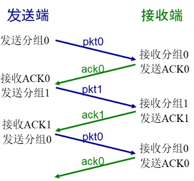

- 发送端：【差错校验】按序发送数据报
- 接收端：【差错校验】按序接收报文段，并回复ACK报文，确认序列号ack=接收到的报文段发送序列号seq

**分组丢失**

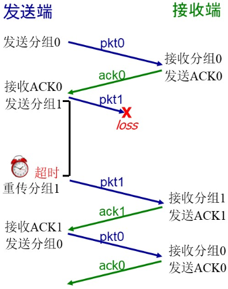

- 发送端：【差错校验】在发送端发送数据报的同时定时器启动计时，当超时仍然未收到接收端的ACK报文段时，启动超时重传机制重传数据报
- 接收端：【差错校验】按序接收报文段，并回复ACK报文，确认序列号ack=接收到的报文段发送序列号seq

**ACK丢失**

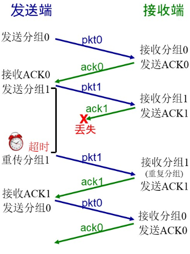

- 发送端：【差错校验】在发送端发送数据报的同时定时器启动计时，当超时仍然未收到接收端的ACK报文段时，启动超时重传机制重传数据报
- 接收端：【差错校验】如果接收到重复报文段，在实际应用中将会丢弃重复报文段，即不交付上层应用，在本次实验中的传输日志以**[\*\*重复报文段\*\*]**标识，但仍然回复ACK报文段

**失序问题**

采用序列号机制和停等机制

- 发送端： 【差错校验】在发送端发送数据报的同时定时器启动计时，当超时仍然未收到接收端的ACK报文段时，启动超时重传机制重传数据报；当收到的ack不等于期待收到的ack时，不采取动作，继续等待
- 接收端：【差错校验】如果接收到重复报文段，在实际应用中将会丢弃重复报文段，即不交付上层应用，在本次实验中的传输日志以**[\*\*重复报文段\*\*]**标识，但仍然回复ACK报文段

### （四）断开连接

断开连接，我们参考TCP断连过程【四次挥手】设计断连协议【三次挥手】，由于我们的服务器不会向客户端发送数据，因此将TCP断连协议的四次挥手中的第二次挥手和第三次挥手合并为一次挥手，具体设计如下：

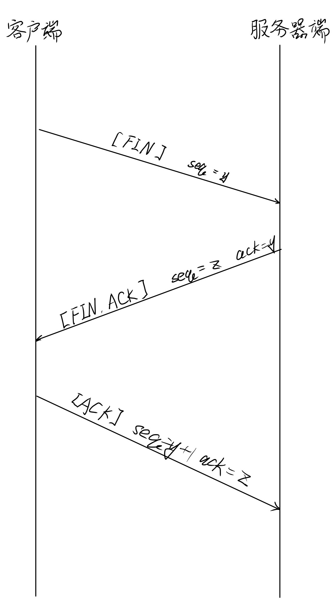

可以看到我们断连的三次挥手与建连的三次握手相似，主要改变为标志位，其余逻辑基本相似，故不在此作进一步分析。特别的，我们在客户端添加了**关闭等待——2MSL等待**【在探索中解释为什么需要等待】。

### （五）程序使用

客户端控制是否连接：

- 当客户端接收符号为**q/Q**时断开连接
- 当客户端接受符号**r/R**时建立连接准备传输文件

## 三、功能模块实现与分析

### （一）报文格式

对于标志位为了方便程序编写，我们在头文件`MessageFormat.h`中使用全局常量的方式设置；并对于一些关于文件传输的常量采取宏定义：

```C++
// 宏定义：一些关于文件传输的常量
#define MAX_WAIT_TIME 0.5 * CLOCKS_PER_SEC  // 超时时间上限为500毫秒
#define MAX_RESEND_TIMES 10  // 超时重传次数上限为10次
#define MAX_FILE_SIZE 100 * 1000000  // 最大文件大小为100兆字节
#define MAX_MSG_SIZE 10000  // 最大文件大小为10000字节

// 定义常量：报文中的标志位
/*
	对于标志位做出特别说明：标志位共16位，现只使用了低四位
	(高位)| Unused | QUIT(1bit) | FILEFLAG(1 bit) | ACK(1 bit) | SYN(1 bit) | FIN(1 bit) |(低位)
	FILEFLAG	表示该包是传输文件相关信息【文件名、文件大小】的数据包
*/
const unsigned short int FIN = 0x1;  // 0000_0000_0000_0001
const unsigned short int SYN = 0x2;  // 0000_0000_0000_0010
const unsigned short int ACK = 0x4;  // 0000_0000_0000_0100
const unsigned short int FILEFLAG = 0x8;  // 0000_0000_0000_1000
const unsigned short int QUIT = 0x10;  // 0000_0000_0001_0000
```

在头文件`MessageFormat.h`中设计实现我们的报文格式，报文格式主体使用结构体`MsgFormat`实现：

```C++
// 默认情况下，编译器通常会使用一些对齐策略进行性能优化，但是我们希望保证结构体内的数据强制按照设计格式排列
#pragma pack(1)  // 禁用对齐优化
struct MsgFormat {
	uint32_t SrcIP, DestIP;	 // 源ip地址（1-4字节）、目的ip地址（5-8字节）——本部分设计是参照UDP报文格式的完整性，但是对于我们本次实验测试而言，由于是本地回环，这两个数据并未使用
	uint16_t SrcPort, DestPort;  // 源端口号（9-10字节）、目的端口号（11-12字节）
	uint32_t seq, ack, size;  // 发送序列号（13-16字节）、确认序列号（17-20字节）、数据大小（21-24字节）
	uint16_t CheckNum, Flag;  // 校验和（25-26字节）、标志位（27-28字节）
	//====== 首部 ===== 数据 ===== 分界线 =====
	BYTE MSGDataBuf[MAX_MSG_SIZE];  // 数据部分：包括文件名称和文件大小
	MsgFormat();  // 报文构造函数
	void setCheckNum();  // 设置校验和——发送端
	bool check();  // 校验函数——接收端
};
#pragma pack()  // 使用对齐优化
```

**校验和**

我们在结构体中定义了校验和的设置函数以及校验函数，其实现逻辑为：

- **发送端	设置校验和**
  - 校验和域段清零【同时填充0】
  - 以16位（2字节）为单位对数据报进行求和运算，注意溢出部分回加
  - 将最终结果（变量低16位）取反填充校验和域段
- **接收端	校验和确认**
  - 以16位（2字节）为单位对数据报进行求和运算，注意溢出部分回加
  - 最终结果（变量低16位）若是全1，则表示未检测到错误，否则说明数据报存在差错
  - 机制解释：由于此时校验和已存在，求和运算实际上是原码+反码，那么正常情况下得到的应该是全1的数据

```C++
void MsgFormat::setCheckNum() {
	this->CheckNum = 0;  // 校验和域段清零
	unsigned int sum = 0;  // 求和值
	unsigned short* MSGBuf = (unsigned short*)this;
	// 将缓冲区中的每两个字节相加
	for (int i = 0; i < sizeof(*this); i += 2) {
		sum += *MSGBuf++;
		if (sum & 0xFFFF0000) {  // 存在进位，则回加到求和值中
			sum &= 0xFFFF;  // 保留求和值低16位
			sum++;  // 回加进位
		}
	}
	this->CheckNum = ~(sum & 0xFFFF);  // 保留求和值低16位并取反得到校验和
}

bool MsgFormat::check() {
	unsigned int sum = 0;  // 求和值
	unsigned short* MSGBuf = (unsigned short*)this;
	// 将缓冲区中的每两个字节相加
	for (int i = 0; i < sizeof(*this); i += 2) {
		sum += *MSGBuf++;
		if (sum & 0xFFFF0000) {  // 存在进位，则回加到求和值中
			sum &= 0xFFFF;  // 保留求和值低16位
			sum++;  // 回加进位
		}
	}
	// 由于我们设置的校验和是求和值的反码，因此现在我们实际上得到的 sum 是 校验和+校验和反码
	// 显然如果不出意外的话原码和反码相加得到的是全1的数据，即当我们得到全1的数据表示校验无误
	if ((sum & 0xFFFF) == 0xFFFF) {  // 保留求和值低16位并与全1数据比较
		return true;  // 全1——校验无误
	}
	else {
		return false;  // 否则存在错误
	}
}
```

### （二）建立连接

**客户端**

- 发送第一次握手报文——计时器启动
- 接收第二次握手报文——超时重传第一次握手报文；检验校验和、标志位以及确认序列号
- 发送第三次握手报文

```C++
bool myconnect(SOCKET clientSocket, SOCKADDR_IN serverAddr) {
	int addrlen = sizeof(serverAddr);
	//============================第一次握手===========================
	// SYN = 1, seq = x
	MsgFormat handshake1;  // 第一次握手数据报
	handshake1.SrcPort = ClientPORT;
	handshake1.DestPort = RouterPORT;
	handshake1.seq = relative_seq;
	relative_seq++;
	handshake1.Flag += SYN;
	handshake1.setCheckNum();
	// cout << "发送handshake1.seq =" << handshake1.seq << endl;
	int err = sendto(clientSocket, (char*)&handshake1, sizeof(handshake1), 0, (sockaddr*)&serverAddr, addrlen);
	clock_t handshake1start = clock();
	if (err == -1) {
		cout << "[错误] 连接失败..." << endl;
		cout << "===============================================" << endl;
		return false;
	}
	cout << "[系统提示] 第一次握手报文发送成功！" << endl;
	//============================第二次握手===========================
	// SYN = 1, ACK = 1, seq = w, ack = x
	MsgFormat handshake2;  // 第二次握手数据报
	u_long mode = 1;
	ioctlsocket(clientSocket, FIONBIO, &mode);  // 非阻塞
	while (recvfrom(clientSocket, (char*)&handshake2, sizeof(handshake2), 0, (sockaddr*)&serverAddr, &addrlen) <= 0) {
		//	第一次握手超时，重新发送并重新计时
		if (clock() - handshake1start > MAX_WAIT_TIME) {
			cout << "-----------------------------------------------" << endl;
			cout << "[系统提示] 第一次握手超时，正在重传..." << endl;
			cout << "-----------------------------------------------" << endl;
			err = sendto(clientSocket, (char*)&handshake1, sizeof(handshake1), 0, (sockaddr*)&serverAddr, addrlen);
			handshake1start = clock();
			if (err == -1) {
				cout << "[错误] 连接失败..." << endl;
				cout << "===============================================" << endl;
				return false;
			}
		}
	}
	// cout << "接收handshake2.seq =" << handshake2.seq << "handshake2.ack =" << handshake2.ack << endl;
	if ((handshake2.Flag && SYN) && (handshake2.Flag && ACK) && handshake2.check() && (handshake2.ack == handshake1.seq)) {
		cout << "[系统提示] 第二次握手报文确认成功！" << endl;
	}
	else {
		cout << "[错误] 连接发生错误..." << endl;
		cout << "===============================================" << endl;
		return false;
	}
	//============================第三次握手===========================
	// ACK = 1, seq = x + 1, ack = w
	MsgFormat handshake3;  // 第三次握手数据报
	handshake3.SrcPort = ClientPORT;
	handshake3.DestPort = RouterPORT;
	handshake3.seq = relative_seq;
	relative_seq++;
	handshake3.ack = handshake2.seq;
	handshake3.Flag += ACK;
	handshake3.setCheckNum();
	// cout << "发送handshake3.seq =" << handshake3.seq << "handshake3.ack =" << handshake3.ack << endl;
	err = sendto(clientSocket, (char*)&handshake3, sizeof(handshake3), 0, (sockaddr*)&serverAddr, addrlen);
	clock_t handshake3start = clock();
	if (err == -1) {
		cout << "[错误] 连接失败..." << endl;
		cout << "===============================================" << endl;
		return false;
	}
	cout << "[系统提示] 第三次握手报文发送成功！" << endl;
	cout << "[系统提示] 连接成功！" << endl;
	return true;
}
```

**服务器**

- 接收第一次握手报文——检验校验和与标志位
- 发送第二次握手报文——计时器启动
- 接受第三次握手报文——超时重传第二次握手报文；检验校验和、标志位以及确认序列号

```C++
// 建连函数
bool myconnect(SOCKET serverSocket, SOCKADDR_IN clientAddr) {
	int addrlen = sizeof(clientAddr);
	//============================第一次握手===========================
	// SYN = 1, seq = x
	MsgFormat handshake1;  // 第一次握手数据报
	//============================第二次握手===========================
	// SYN = 1, ACK = 1, seq = w, ack = x
	MsgFormat handshake2;  // 第二次握手数据报
	//============================第三次握手===========================
	// ACK = 1, seq = x + 1, ack = w
	MsgFormat handshake3;  // 第三次握手数据报
	while (1) {
		//============================第一次握手===========================
		int recvByte = recvfrom(serverSocket, (char*)&handshake1, sizeof(handshake1), 0, (sockaddr*)&clientAddr, &addrlen);
		if (recvByte == -1) {
			cout << "[错误] 连接失败..." << endl;
			cout << "===============================================" << endl;
			return false;
		}
		else if (recvByte > 0) {
			if (!(handshake1.Flag && SYN) || !handshake1.check()) {
				cout << "[错误] 连接发生错误..." << endl;
				cout << "===============================================" << endl;
				return false;
			}
			// cout << "接收handshake1.seq =" << handshake1.seq << endl;
			cout << "[系统提示] 第一次握手报文接收成功！" << endl;
			//============================第二次握手===========================
			handshake2.SrcPort = ServerPORT;
			handshake2.DestPort = RouterPORT;
			handshake2.seq = relative_seq;
			relative_seq++;
			handshake2.ack = handshake1.seq;
			handshake2.Flag += SYN;
			handshake2.Flag += ACK;
			handshake2.setCheckNum();
			// cout << "发送handshake2.seq =" << handshake2.seq << "handshake2.ack =" << handshake2.ack << endl;
			int err = sendto(serverSocket, (char*)&handshake2, sizeof(handshake2), 0, (sockaddr*)&clientAddr, addrlen);
			clock_t handshake2start = clock();
			if (err == -1) {
				cout << "[错误] 连接失败..." << endl;
				cout << "===============================================" << endl;
				return false;
			}
			cout << "[系统提示] 第二次握手报文发送成功！" << endl;
			//============================第三次握手===========================
			while (recvfrom(serverSocket, (char*)&handshake3, sizeof(handshake3), 0, (sockaddr*)&clientAddr, &addrlen) <= 0) {
				//	第一次握手超时，重新发送并重新计时
				if (clock() - handshake2start > MAX_WAIT_TIME) {
					cout << "-----------------------------------------------" << endl;
					cout << "[系统提示] 第二次握手超时，正在重传..." << endl;
					cout << "-----------------------------------------------" << endl;
					err = sendto(serverSocket, (char*)&handshake2, sizeof(handshake2), 0, (sockaddr*)&clientAddr, addrlen);
					handshake2start = clock();
					if (err == -1) {
						cout << "[错误] 连接失败..." << endl;
						cout << "===============================================" << endl;
						return false;
					}
				}
			}
			// cout << "接收handshake3.seq =" << handshake3.seq << "handshake3.ack =" << handshake3.ack << endl;
			if ((handshake3.Flag && ACK) && handshake3.check() && handshake3.ack == handshake2.seq) {
				cout << "[系统提示] 第三次握手报文确认成功！" << endl;
				cout << "[系统提示] 连接成功！" << endl;
				return true;
			}
			else {
				cout << "[错误] 连接发生错误..." << endl;
				cout << "===============================================" << endl;
				return false;
			}
		}
	}
}
```

### （三）可靠数据传输

**客户端**

```C++
#include <iostream>
#include <cstring>
#include <string>
#include <winsock2.h>  // 套接字接口
#include <Ws2tcpip.h>  // 套接字新函数库
#include <time.h>
#include <fstream>
#include "MessageFormat.h"  // 数据报格式
#pragma comment (lib, "ws2_32.lib")  // 套接字实现
using namespace std;
#define RouterPORT 30000  // 路由器端口号
#define ClientPORT 20000  // 客户端端口号

int relative_seq = 0;  // 为了便于实现我们不采用随机分配序列号的方式，而是采用类似于Wireshark捕获中的相对序列号，即从 0 开始
MsgFormat sendtmp;
// 建连函数
bool myconnect(SOCKET clientSocket, SOCKADDR_IN serverAddr) {
	int addrlen = sizeof(serverAddr);
	//============================第一次握手===========================
	// SYN = 1, seq = x
	MsgFormat handshake1;  // 第一次握手数据报
	handshake1.SrcPort = ClientPORT;
	handshake1.DestPort = RouterPORT;
	handshake1.seq = relative_seq;
	relative_seq++;
	handshake1.Flag += SYN;
	handshake1.setCheckNum();
	// cout << "发送handshake1.seq =" << handshake1.seq << endl;
	int err = sendto(clientSocket, (char*)&handshake1, sizeof(handshake1), 0, (sockaddr*)&serverAddr, addrlen);
	clock_t handshake1start = clock();
	if (err == -1) {
		cout << "[错误] 连接失败..." << endl;
		cout << "===============================================" << endl;
		return false;
	}
	cout << "[系统提示] 第一次握手报文发送成功！" << endl;
	//============================第二次握手===========================
	// SYN = 1, ACK = 1, seq = w, ack = x
	MsgFormat handshake2;  // 第二次握手数据报
	u_long mode = 1;
	ioctlsocket(clientSocket, FIONBIO, &mode);  // 非阻塞
	while (recvfrom(clientSocket, (char*)&handshake2, sizeof(handshake2), 0, (sockaddr*)&serverAddr, &addrlen) <= 0) {
		//	第一次握手超时，重新发送并重新计时
		if (clock() - handshake1start > MAX_WAIT_TIME) {
			cout << "-----------------------------------------------" << endl;
			cout << "[系统提示] 第一次握手超时，正在重传..." << endl;
			cout << "-----------------------------------------------" << endl;
			err = sendto(clientSocket, (char*)&handshake1, sizeof(handshake1), 0, (sockaddr*)&serverAddr, addrlen);
			handshake1start = clock();
			if (err == -1) {
				cout << "[错误] 连接失败..." << endl;
				cout << "===============================================" << endl;
				return false;
			}
		}
	}
	// cout << "接收handshake2.seq =" << handshake2.seq << "handshake2.ack =" << handshake2.ack << endl;
	if ((handshake2.Flag && SYN) && (handshake2.Flag && ACK) && handshake2.check() && (handshake2.ack == handshake1.seq)) {
		cout << "[系统提示] 第二次握手报文确认成功！" << endl;
	}
	else {
		cout << "[错误] 连接发生错误..." << endl;
		cout << "===============================================" << endl;
		return false;
	}
	//============================第三次握手===========================
	// ACK = 1, seq = x + 1, ack = w
	MsgFormat handshake3;  // 第三次握手数据报
	handshake3.SrcPort = ClientPORT;
	handshake3.DestPort = RouterPORT;
	handshake3.seq = relative_seq;
	relative_seq++;
	handshake3.ack = handshake2.seq;
	handshake3.Flag += ACK;
	handshake3.setCheckNum();
	// cout << "发送handshake3.seq =" << handshake3.seq << "handshake3.ack =" << handshake3.ack << endl;
	err = sendto(clientSocket, (char*)&handshake3, sizeof(handshake3), 0, (sockaddr*)&serverAddr, addrlen);
	clock_t handshake3start = clock();
	if (err == -1) {
		cout << "[错误] 连接失败..." << endl;
		cout << "===============================================" << endl;
		return false;
	}
	cout << "[系统提示] 第三次握手报文发送成功！" << endl;
	cout << "[系统提示] 连接成功！" << endl;
	return true;
}
int num = 0;
// 报文传输辅助函数
bool msgSend(MsgFormat& sendMsg, SOCKET clientSocket, SOCKADDR_IN serverAddr) {
	if (sendMsg.seq == 3) {  // 仅作为检测需要
		num = sendMsg.CheckNum;
		sendMsg.CheckNum = 0;
	}
	int addrlen = sizeof(serverAddr);
	sendto(clientSocket, (char*)&sendMsg, sizeof(sendMsg), 0, (sockaddr*)&serverAddr, addrlen);
	cout << "[传输日志] " << sendMsg.SrcPort << " -> " << sendMsg.DestPort << " size = " << sendMsg.size << "B seq = " << sendMsg.seq << " Flag=" << sendMsg.Flag << endl;
	int resendTimes = 0;  // 重传次数
	MsgFormat recvMsg;
	int msgStart = clock();  // 记录发送时间
	while (1) {
		u_long mode = 1;
		ioctlsocket(clientSocket, FIONBIO, &mode);  // 非阻塞
		while (recvfrom(clientSocket, (char*)&recvMsg, sizeof(recvMsg), 0, (sockaddr*)&serverAddr, &addrlen) <= 0) {
			// 停等机制：若尚未收到数据包或检查出现错误，则继续等待
			if (clock() - msgStart > MAX_WAIT_TIME) {  // 超时仍未收到数据包（ACK），重新发送数据包并重新计时
				cout << "[传输日志] seq = " << sendMsg.seq << "的报文段 第" << ++resendTimes << "次超时，正在重传..." << endl;
				sendto(clientSocket, (char*)&sendMsg, sizeof(sendMsg), 0, (sockaddr*)&serverAddr, addrlen);
				msgStart = clock();
			}
			if (resendTimes == MAX_RESEND_TIMES) {
				cout << "[传输日志] 超时重传超过最大重传次数：" << MAX_RESEND_TIMES << "，传输失败..." << endl;
				return false;
			}
		}
		if ((recvMsg.Flag && ACK) && (recvMsg.ack == sendtmp.seq)) {
			cout << "[传输日志] [校验和错误——接收到上一个ACK报文]" << recvMsg.SrcPort << " -> " << recvMsg.DestPort << " seq = " << recvMsg.seq << " ack = " << recvMsg.ack << " Flag = " << recvMsg.Flag << endl;
			cout << "[传输日志] seq = " << sendMsg.seq << "的报文段，因校验和错误正在重传..." << endl;
			sendMsg.CheckNum = num;
			sendto(clientSocket, (char*)&sendMsg, sizeof(sendMsg), 0, (sockaddr*)&serverAddr, addrlen);
			msgStart = clock();
		}
		if ((recvMsg.Flag && ACK) && (recvMsg.ack == sendMsg.seq)) {  // 理想情况：无丢失
			cout << "[传输日志] " << recvMsg.SrcPort << " -> " << recvMsg.DestPort << " seq = " << recvMsg.seq << " ack = " << recvMsg.ack << " Flag = " << recvMsg.Flag << endl;
			sendtmp = sendMsg;
			return true;
		}
	}
	u_long mode = 0;
	ioctlsocket(clientSocket, FIONBIO, &mode);//改回阻塞模式
	return false;
}
// 报文传输函数
void SendFunc(string path, SOCKET clientSocket, SOCKADDR_IN serverAddr) {
	int startTime = clock();
	string filename = "";
	for (int i = path.size() - 1; i >= 0; i--) {  // 逆序获取逆序文件名
		if (path[i] == '/' || path[i] == '\\')
			break;
		filename += path[i];
	}
	filename = string(filename.rbegin(), filename.rend());  // 逆序获取正序文件名
	ifstream f(path.c_str(), ifstream::binary);  // 以二进制方式读取文件
	if (!f) {
		cout << "[传输日志] 无法打开文件..." << endl;
		return;
	}
	BYTE* fileBuffer = new BYTE[MAX_FILE_SIZE];
	unsigned int fileSize = 0;
	BYTE byte = f.get();
	while (f) {  // 将文件读取到缓冲区
		fileBuffer[fileSize++] = byte;
		byte = f.get();
	}
	f.close();
	//===========================文件名和大小==========================
	MsgFormat rMsg;
	rMsg.SrcPort = ClientPORT;
	rMsg.DestPort = RouterPORT;
	rMsg.size = fileSize;
	rMsg.Flag += FILEFLAG;
	rMsg.seq = relative_seq;
	relative_seq++;
	for (int i = 0; i < filename.size(); i++)  // 填充报文数据段
		rMsg.MSGDataBuf[i] = filename[i];
	rMsg.MSGDataBuf[filename.size()] = '\0';//字符串结尾补\0
	rMsg.setCheckNum();
	if (!msgSend(rMsg, clientSocket, serverAddr)) {
		cout << "[传输日志] 传输失败..." << endl;
		return;
	}
	cout << "[传输日志] 成功传输文件相关信息——文件名：" << filename << " 文件大小：" << fileSize << "B" << endl;
	//===========================文件数据部分==========================
	int batchNum = fileSize / MAX_MSG_SIZE;  // 满载报文数
	int leftSize = fileSize % MAX_MSG_SIZE;  // 剩余报文大小
	for (int i = 0; i < batchNum; i++) {  // i + 1 - 第几个满载报文
		MsgFormat dMsg;
		dMsg.SrcPort = ClientPORT;
		dMsg.DestPort = RouterPORT;
		dMsg.size = MAX_MSG_SIZE;
		dMsg.seq = relative_seq;
		relative_seq++;
		for (int j = 0; j < MAX_MSG_SIZE; j++)
			dMsg.MSGDataBuf[j] = fileBuffer[i * MAX_MSG_SIZE + j];  // 第 i + 1 个满载报文装载
		dMsg.setCheckNum();
		if (!msgSend(dMsg, clientSocket, serverAddr)) {
			cout << "[传输日志] 传输失败..." << endl;
			return;
		}
		cout << "[传输日志] 成功传输第 " << i << " 个最大装载报文段" << endl;
	}
	if (leftSize > 0) {
		MsgFormat dMsg;
		dMsg.SrcPort = ClientPORT;
		dMsg.DestPort = RouterPORT;
		dMsg.size = leftSize;
		dMsg.seq = relative_seq;
		relative_seq++;
		for (int j = 0; j < leftSize; j++) {
			dMsg.MSGDataBuf[j] = fileBuffer[batchNum * MAX_MSG_SIZE + j];
		}
		dMsg.setCheckNum();
		if (!msgSend(dMsg, clientSocket, serverAddr)) {
			cout << "[传输日志] 传输失败..." << endl;
			return;
		}
		cout << "[传输日志] 成功发送剩余部分的报文段" << endl;
	}
	//计算传输时间和吞吐率
	int endTime = clock();
	cout << "-----------------------------------------------" << endl;
	cout << "[传输日志] 总体传输时间为:" << (endTime - startTime) / CLOCKS_PER_SEC << "s" << endl;
	cout << "[传输日志] 吞吐率:" << ((float)fileSize) / ((endTime - startTime) / CLOCKS_PER_SEC) << "byte/s" << endl;
	cout << "===============================================" << endl;
	return;
}
// 断连函数
bool mydisconnect(SOCKET clientSocket, SOCKADDR_IN serverAddr) {
	int addrlen = sizeof(serverAddr);
	//============================第一次挥手===========================
	// FIN = 1, seq = y
	MsgFormat wave1;  // 第一次挥手数据报
	wave1.SrcPort = ClientPORT;
	wave1.DestPort = RouterPORT;
	wave1.Flag += FIN;
	wave1.seq = relative_seq;
	relative_seq++;
	wave1.setCheckNum();
	// cout << "发送wave1.seq=" << wave1.seq << endl;
	int err = sendto(clientSocket, (char*)&wave1, sizeof(wave1), 0, (sockaddr*)&serverAddr, addrlen);
	clock_t wave1start = clock();
	if (err == -1) {
		cout << "[错误] 断连失败..." << endl;
		cout << "===============================================" << endl;
		return false;
	}
	cout << "[系统提示] 第一次挥手报文发送成功！" << endl;
	//============================第二次挥手===========================
	// FIN = 1, ACK = 1, seq = z, ack = y
	MsgFormat wave2;  // 第二次挥手数据报
	u_long mode = 1;
	ioctlsocket(clientSocket, FIONBIO, &mode);  // 非阻塞
	while (recvfrom(clientSocket, (char*)&wave2, sizeof(wave2), 0, (sockaddr*)&serverAddr, &addrlen) <= 0) {
		//	第一次挥手超时，重新发送并重新计时
		if (clock() - wave1start > MAX_WAIT_TIME) {
			cout << "-----------------------------------------------" << endl;
			cout << "[系统提示] 第一次挥手超时，正在重传..." << endl;
			cout << "-----------------------------------------------" << endl;
			err = sendto(clientSocket, (char*)&wave1, sizeof(wave1), 0, (sockaddr*)&serverAddr, addrlen);
			wave1start = clock();
			if (err == -1) {
				cout << "[错误] 断连失败..." << endl;
				cout << "===============================================" << endl;
				return false;
			}
		}
	}
	// cout << "接收wave2.ack=" << wave2.ack << " wave2.seq=" << wave2.seq << endl;
	if ((wave2.Flag && FIN) && (wave2.Flag && ACK) && wave2.check() && (wave2.ack == wave1.seq)) {
		cout << "[系统提示] 第二次挥手报文确认成功！" << endl;
	}
	else {
		cout << "[错误] 断连发生错误..." << endl;
		cout << "===============================================" << endl;
		return false;
	}
	//============================第三次挥手===========================
	// ACK = 1, seq = y + 1, ack = z
	MsgFormat wave3;  // 第三次握手数据报
	wave3.SrcPort = ClientPORT;
	wave3.DestPort = RouterPORT;
	wave3.seq = relative_seq;
	relative_seq++;
	wave3.ack = wave2.seq;
	wave3.Flag += ACK;
	wave3.setCheckNum();
	clock_t wave3start = clock();
	// cout << "发送wave3.ack=" << wave3.ack << " wave3.seq=" << wave3.seq << endl;
	err = sendto(clientSocket, (char*)&wave3, sizeof(wave3), 0, (sockaddr*)&serverAddr, addrlen);
	if (err == -1) {
		cout << "[错误] 断连失败..." << endl;
		cout << "===============================================" << endl;
		return false;
	}
	cout << "[系统提示] 第三次挥手报文发送成功！" << endl;
	//=======================等待2MSL防止ACK丢失=======================
	int waittime = clock();
	cout << "[系统提示] 客户端2MSL等待..." << endl;
	MsgFormat tmp;
	while (clock() - waittime < 2 * MAX_WAIT_TIME) {
		int recvByte = recvfrom(clientSocket, (char*)&tmp, sizeof(tmp), 0, (sockaddr*)&serverAddr, &addrlen);
		if (recvByte == 0) {
			cout << "[系统提示] 断连发送错误..." << endl;
			return false;
		}
		else if (recvByte > 0)
		{
			sendto(clientSocket, (char*)&wave3, sizeof(wave3), 0, (sockaddr*)&serverAddr, addrlen);
			cout << "[系统提示] 重传ACK" << endl;
		}
	}
	cout << "[系统提示] 断连成功！" << endl;
	return true;
}
int main() {
	cout << "===============================================" << endl;
	cout << "==================叡神客户端===================" << endl;
	cout << "===============================================" << endl;
	cout << "叡神客户端[版本 23.11.15.0]      开发者-Yuzhao-" << endl;
	cout << "===============================================" << endl;
	cout << "==================客户端准备===================" << endl;
	//========================初始化Socket DLL=========================
	WORD wVersionRequested = MAKEWORD(2, 2);  // 版本请求：MAKEWORD(次版本号, 主版本号)
	WSAData wsadata;  // 套接字实现的详细信息
	int err = WSAStartup(wVersionRequested, &wsadata);  // err是WSAStartup函数的返回值——错误代码
	if (err != NO_ERROR) {
		cout << "[错误] 初始化Socket DLL失败，错误代码: " << WSAGetLastError() << endl;
		cout << "===============================================" << endl;
		system("pause");
		return 1;
	}
	cout << "[系统提示] 初始化Socket DLL成功！" << endl;
	//============================创建Socket===========================
	SOCKET clientSocket = socket(AF_INET, SOCK_DGRAM, 0);  // 本次实验采用Internet协议版本4（IPv4）地址族、数据报套接字
	if (clientSocket == INVALID_SOCKET) {
		cout << "[错误] 创建Socket失败，错误代码: " << WSAGetLastError() << endl;
		cout << "===============================================" << endl;
		WSACleanup();  // 释放 Socket DLL 资源
		system("pause");
		return 1;
	}
	cout << "[系统提示] 创建Socket成功！" << endl;
	//=========================服务器/路由器地址=======================
	SOCKADDR_IN serverAddr;  // 服务端地址信息的数据结构IPv4
	serverAddr.sin_family = AF_INET;  // 协议族，IPv4地址族
	inet_pton(AF_INET, "127.0.0.1", &serverAddr.sin_addr.s_addr);  // 地址
	serverAddr.sin_port = htons(RouterPORT);  // 端口号
	//============================客户端地址===========================
	SOCKADDR_IN clientAddr;  // 客户端地址信息的数据结构IPv4
	clientAddr.sin_family = AF_INET;  // 协议族，IPv4地址族
	inet_pton(AF_INET, "127.0.0.1", &clientAddr.sin_addr.s_addr);  // 地址
	clientAddr.sin_port = htons(ClientPORT);  // 端口号
	//=============================绑定 bind===========================
	err = bind(clientSocket, (SOCKADDR*)&clientAddr, sizeof(clientAddr));
	if (err == SOCKET_ERROR) {
		cout << "[错误] bind 绑定失败，错误代码: " << WSAGetLastError() << endl;
		cout << "===============================================" << endl;
		closesocket(clientSocket);
		WSACleanup();
		system("pause");
		return 1;
	}
	cout << "[系统提示] bind 绑定端口 " << ClientPORT << " 成功！" << endl;
	//===========================连接 connect==========================
	bool res = myconnect(clientSocket, serverAddr);
	if (!res) {  // 连接失败
		system("pause");
		return 1;
	}
	//=============================系统简介============================
	cout << "===============================================" << endl;
	cout << "               欢迎使用叡神传输                " << endl;
	cout << "***********************************************" << endl;
	cout << "  * 使用说明：" << endl;
	cout << "    $ 输入 q/Q 关闭连接" << endl;
	cout << "    $ 输入 r/R 传输文件" << endl;
	cout << "  * 标志位说明：" << endl;
	cout << "    $ FIN = 0000_0000_0000_0001" << endl;
	cout << "    $ SYN = 0000_0000_0000_0010" << endl;
	cout << "    $ ACK = 0000_0000_0000_0100" << endl;
	cout << "    $ FILEFLAG = 0000_0000_0000_1000" << endl;
	cout << "    $ 组合标志位为各项加和，最终输出的为十进制数" << endl;
	cout << "-----------------------------------------------" << endl;
	// 获取时间
	time_t t = time(NULL);
	char time_str[64];
	ctime_s(time_str, sizeof(time_str), &t);
	cout << "        时间：" << time_str;
	cout << "===============================================" << endl;
	while (res) {
		char c;
		cout << "[系统提示] 请输入选择您要使用的功能：";
		cin >> c;
		if (c == 'r' || c == 'R')
		{
			string filepath;
			cout << "[系统提示] 请输入文件绝对路径：" << endl;
			cin >> filepath;
			MsgFormat qMsg;
			qMsg.SrcPort = ClientPORT;
			qMsg.DestPort = RouterPORT;
			qMsg.setCheckNum();
			sendto(clientSocket, (char*)&qMsg, sizeof(qMsg), 0, (sockaddr*)&serverAddr, sizeof(SOCKADDR_IN));
			//=============================文件传输============================
			SendFunc(filepath, clientSocket, serverAddr);
		}
		else if (c == 'q' || c == 'Q')
		{
			MsgFormat qMsg;
			qMsg.SrcPort = ClientPORT;
			qMsg.DestPort = RouterPORT;
			qMsg.Flag += QUIT;
			qMsg.setCheckNum();
			sendto(clientSocket, (char*)&qMsg, sizeof(qMsg), 0, (sockaddr*)&serverAddr, sizeof(SOCKADDR_IN));
			res = false;  // 退出循环
		}
	}
	//========================关闭连接 disconnect======================
	cout << "[系统提示] 正在断连..." << endl;
	mydisconnect(clientSocket, serverAddr);
	closesocket(clientSocket); //关闭socket
	WSACleanup();
	cout << "===============================================" << endl;
	system("pause");
	return 0;
}
```

**服务器**

```C++
// 报文接收辅助函数
bool msgRecv(MsgFormat& recvMsg, SOCKET serverSocket, SOCKADDR_IN clientAddr) {
	int addrlen = sizeof(clientAddr);
	while (1) {
		int recvByte = recvfrom(serverSocket, (char*)&recvMsg, sizeof(recvMsg), 0, (sockaddr*)&clientAddr, &addrlen);
		if (recvByte > 0) {
			if (recvMsg.check() && ((recvMsg.seq == relative_seq + 1))) {
				MsgFormat ackMsg;
				ackMsg.SrcPort = ServerPORT;
				ackMsg.DestPort = RouterPORT;
				ackMsg.Flag += ACK;
				ackMsg.seq = relative_seq;
				relative_seq++;
				ackMsg.ack = recvMsg.seq;
				ackMsg.setCheckNum();
				sendto(serverSocket, (char*)&ackMsg, sizeof(ackMsg), 0, (sockaddr*)&clientAddr, addrlen);
				cout << "[传输日志] " << recvMsg.SrcPort << " -> " << recvMsg.DestPort << " seq = " << recvMsg.seq << " Flag = " << recvMsg.Flag << endl;
				cout << "[传输日志] " << ackMsg.SrcPort << " -> " << ackMsg.DestPort << " seq=" << ackMsg.seq << " ack = " << ackMsg.ack << " Flag=" << ackMsg.Flag << endl;
				acktmp = ackMsg;
				return true;
			}
			// 如果 seq != relative_seq + 1，表示有重复的报文，处理方式：丢弃该报文并重传ACK
			// 触发原因：客户端未接收到服务器的ACK，超时重传
			else if (recvMsg.check() && ((recvMsg.seq != relative_seq + 1))) {
				MsgFormat ackMsg;
				ackMsg.SrcPort = ServerPORT;
				ackMsg.DestPort = RouterPORT;
				ackMsg.Flag += ACK;
				ackMsg.seq = relative_seq;
				relative_seq++;
				ackMsg.ack = recvMsg.seq;
				ackMsg.setCheckNum();
				sendto(serverSocket, (char*)&ackMsg, sizeof(ackMsg), 0, (sockaddr*)&clientAddr, addrlen);
				cout << "[传输日志] [**重复报文段**]" << recvMsg.SrcPort << " -> " << recvMsg.DestPort << " seq = " << recvMsg.seq << " Flag = " << recvMsg.Flag << endl;
				cout << "[传输日志] " << ackMsg.SrcPort << " -> " << ackMsg.DestPort << " seq = " << ackMsg.seq << " ack = " << ackMsg.ack << " Flag = " << ackMsg.Flag << endl;
			}
			else {  // 校验和错误，重传上一个ack
				MsgFormat ackMsg;
				ackMsg = acktmp;
				sendto(serverSocket, (char*)&ackMsg, sizeof(ackMsg), 0, (sockaddr*)&clientAddr, addrlen);
				cout << "[传输日志] [**校验和错误**]" << recvMsg.SrcPort << " -> " << recvMsg.DestPort << " seq = " << recvMsg.seq << " Flag = " << recvMsg.Flag << endl;
				cout << "[传输日志] [**校验和错误——重传上一个ACK报文**]" << ackMsg.SrcPort << " -> " << ackMsg.DestPort << " seq = " << ackMsg.seq << " ack = " << ackMsg.ack << " Flag = " << ackMsg.Flag << endl;
			}
		}
		else return false;
	}
}
// 报文接收函数
void RecvFunc(SOCKET serverSocket, SOCKADDR_IN clientAddr) {
	int addrlen = sizeof(clientAddr);
	//===========================文件名和大小==========================
	MsgFormat rMsg;
	unsigned int filesize;
	char filename[50] = { 0 };
	while (1) {
		int recvByte = recvfrom(serverSocket, (char*)&rMsg, sizeof(rMsg), 0, (sockaddr*)&clientAddr, &addrlen);
		if (recvByte > 0) {
			if (rMsg.check() && ((rMsg.seq == relative_seq + 1))) {
				filesize = rMsg.size;  // 获取文件大小
				for (int i = 0; rMsg.MSGDataBuf[i]; i++)  // 获取文件名
					filename[i] = rMsg.MSGDataBuf[i];
				cout << "-----------------------------------------------" << endl;
				cout << "[传输日志] 接收文件：" << filename << "，文件大小：" << filesize << "B" << endl;
				cout << "-----------------------------------------------" << endl;
				MsgFormat ackMsg;
				ackMsg.SrcPort = ServerPORT;
				ackMsg.DestPort = RouterPORT;
				ackMsg.Flag += ACK;
				ackMsg.seq = relative_seq;
				relative_seq++;
				ackMsg.ack = rMsg.seq;
				ackMsg.setCheckNum();
				sendto(serverSocket, (char*)&ackMsg, sizeof(ackMsg), 0, (sockaddr*)&clientAddr, addrlen);
				cout << "[传输日志] " << rMsg.SrcPort << " -> " << rMsg.DestPort << " seq = " << rMsg.seq << " Flag = " << rMsg.Flag << endl;
				cout << "[传输日志] " << ackMsg.SrcPort << " -> " << ackMsg.DestPort << " seq = " << ackMsg.seq << " Flag = " << ackMsg.Flag << endl;
				acktmp = ackMsg;
				break;
			}
			// 如果 seq != relative_seq + 1，表示有重复的报文，处理方式：丢弃该报文并重传ACK
			// 触发原因：客户端未接收到服务器的ACK，超时重传
			else if (rMsg.check() && ((rMsg.seq != relative_seq + 1))) {
				MsgFormat ackMsg;
				ackMsg.SrcPort = ServerPORT;
				ackMsg.DestPort = RouterPORT;
				ackMsg.Flag += ACK;
				ackMsg.seq = relative_seq;
				relative_seq++;
				ackMsg.ack = rMsg.seq;
				ackMsg.setCheckNum();
				sendto(serverSocket, (char*)&ackMsg, sizeof(ackMsg), 0, (sockaddr*)&clientAddr, addrlen);
				cout << "[传输日志] [**重复报文段**]" << rMsg.SrcPort << " -> " << rMsg.DestPort << " seq = " << rMsg.seq << " Flag = " << rMsg.Flag << endl;
				cout << "[传输日志] " << ackMsg.SrcPort << " -> " << ackMsg.DestPort << " seq = " << ackMsg.seq << " Flag = " << ackMsg.Flag << endl;
			}
			else {  // 校验和错误，重传上一个ack
				MsgFormat ackMsg;
				ackMsg = acktmp;
				sendto(serverSocket, (char*)&ackMsg, sizeof(ackMsg), 0, (sockaddr*)&clientAddr, addrlen);
				cout << "[传输日志] [**校验和错误**]" << rMsg.SrcPort << " -> " << rMsg.DestPort << " seq = " << rMsg.seq << " Flag = " << rMsg.Flag << endl;
				cout << "[传输日志] " << ackMsg.SrcPort << " -> " << ackMsg.DestPort << " seq = " << ackMsg.seq << " ack = " << ackMsg.ack << " Flag = " << ackMsg.Flag << endl;
			}
		}
	}
	//===========================文件数据部分==========================
	int batchNum = filesize / MAX_MSG_SIZE;  // 满载报文数
	int leftSize = filesize % MAX_MSG_SIZE;  // 剩余报文大小
	BYTE* fileBuffer = new BYTE[filesize];
	cout << "[传输日志] 开始接收数据，共 " << batchNum << " 个满载报文段，非满载报文大小：" << leftSize << endl;
	for (int i = 0; i < batchNum; i++) {  // i + 1 - 第几个满载报文
		MsgFormat dMsg;
		if (msgRecv(dMsg, serverSocket, clientAddr))
			cout << "[传输日志] " << dMsg.SrcPort << " -> " << dMsg.DestPort << " size = " << dMsg.size << "B seq = " << dMsg.seq << " Flag = " << dMsg.Flag << endl;
		else {
			cout << "[传输日志] 数据接收失败..." << endl;
			cout << "===============================================" << endl;
			return;
		}
		for (int j = 0; j < MAX_MSG_SIZE; j++) {  // 读取数据部分
			fileBuffer[i * MAX_MSG_SIZE + j] = dMsg.MSGDataBuf[j];
		}
	}
	if (leftSize > 0) {
		MsgFormat dMsg;
		if (msgRecv(dMsg, serverSocket, clientAddr))
			cout << "[传输日志] " << dMsg.SrcPort << " -> " << dMsg.DestPort << " size = " << dMsg.size << "B seq = " << dMsg.seq << " Flag = " << dMsg.Flag << endl;
		else {
			cout << "[传输日志] 数据接收失败..." << endl;
			cout << "===============================================" << endl;
			return;
		}
		for (int j = 0; j < leftSize; j++) {
			fileBuffer[batchNum * MAX_MSG_SIZE + j] = dMsg.MSGDataBuf[j];
		}
	}
	cout << "[传输日志] 数据接收成功！正在写入本地..." << endl;
	ofstream f(filename, ofstream::binary);  // 以二进制方式读取文件
	if (f.is_open()) {
		f.write(reinterpret_cast<const char*>(fileBuffer), filesize);
		f.close();
		cout << "[传输日志] 文件写入成功！" << endl;
		cout << "===============================================" << endl;
	}
}
```

### （四）断开连接

**客户端**

- 发送第一次挥手报文——计时器启动
- 接收第二次挥手报文——超时重传第一次挥手报文；检验校验和、标志位以及确认序列号
- 发送第三次挥手报文
- 断连等待2MSL：防止ACK报文丢失

```C++
// 断连函数
bool mydisconnect(SOCKET clientSocket, SOCKADDR_IN serverAddr) {
	int addrlen = sizeof(serverAddr);
	//============================第一次挥手===========================
	// FIN = 1, seq = y
	MsgFormat wave1;  // 第一次挥手数据报
	wave1.SrcPort = ClientPORT;
	wave1.DestPort = RouterPORT;
	wave1.Flag += FIN;
	wave1.seq = relative_seq;
	relative_seq++;
	wave1.setCheckNum();
	// cout << "发送wave1.seq=" << wave1.seq << endl;
	int err = sendto(clientSocket, (char*)&wave1, sizeof(wave1), 0, (sockaddr*)&serverAddr, addrlen);
	clock_t wave1start = clock();
	if (err == -1) {
		cout << "[错误] 断连失败..." << endl;
		cout << "===============================================" << endl;
		return false;
	}
	cout << "[系统提示] 第一次挥手报文发送成功！" << endl;
	//============================第二次挥手===========================
	// FIN = 1, ACK = 1, seq = z, ack = y
	MsgFormat wave2;  // 第二次挥手数据报
	u_long mode = 1;
	ioctlsocket(clientSocket, FIONBIO, &mode);  // 非阻塞
	while (recvfrom(clientSocket, (char*)&wave2, sizeof(wave2), 0, (sockaddr*)&serverAddr, &addrlen) <= 0) {
		//	第一次挥手超时，重新发送并重新计时
		if (clock() - wave1start > MAX_WAIT_TIME) {
			cout << "-----------------------------------------------" << endl;
			cout << "[系统提示] 第一次挥手超时，正在重传..." << endl;
			cout << "-----------------------------------------------" << endl;
			err = sendto(clientSocket, (char*)&wave1, sizeof(wave1), 0, (sockaddr*)&serverAddr, addrlen);
			wave1start = clock();
			if (err == -1) {
				cout << "[错误] 断连失败..." << endl;
				cout << "===============================================" << endl;
				return false;
			}
		}
	}
	// cout << "接收wave2.ack=" << wave2.ack << " wave2.seq=" << wave2.seq << endl;
	if ((wave2.Flag && FIN) && (wave2.Flag && ACK) && wave2.check() && (wave2.ack == wave1.seq)) {
		cout << "[系统提示] 第二次挥手报文确认成功！" << endl;
	}
	else {
		cout << "[错误] 断连发生错误..." << endl;
		cout << "===============================================" << endl;
		return false;
	}
	//============================第三次挥手===========================
	// ACK = 1, seq = y + 1, ack = z
	MsgFormat wave3;  // 第三次握手数据报
	wave3.SrcPort = ClientPORT;
	wave3.DestPort = RouterPORT;
	wave3.seq = relative_seq;
	relative_seq++;
	wave3.ack = wave2.seq;
	wave3.Flag += ACK;
	wave3.setCheckNum();
	clock_t wave3start = clock();
	// cout << "发送wave3.ack=" << wave3.ack << " wave3.seq=" << wave3.seq << endl;
	err = sendto(clientSocket, (char*)&wave3, sizeof(wave3), 0, (sockaddr*)&serverAddr, addrlen);
	if (err == -1) {
		cout << "[错误] 断连失败..." << endl;
		cout << "===============================================" << endl;
		return false;
	}
	cout << "[系统提示] 第三次挥手报文发送成功！" << endl;
	//=======================等待2MSL防止ACK丢失=======================
	int waittime = clock();
	cout << "[系统提示] 客户端2MSL等待..." << endl;
	MsgFormat tmp;
	while (clock() - waittime < 2 * MAX_WAIT_TIME) {
		int recvByte = recvfrom(clientSocket, (char*)&tmp, sizeof(tmp), 0, (sockaddr*)&serverAddr, &addrlen);
		if (recvByte == 0) {
			cout << "[系统提示] 断连发送错误..." << endl;
			return false;
		}
		else if (recvByte > 0)
		{
			sendto(clientSocket, (char*)&wave3, sizeof(wave3), 0, (sockaddr*)&serverAddr, addrlen);
			cout << "[系统提示] 重传ACK" << endl;
		}
	}
	cout << "[系统提示] 断连成功！" << endl;
	return true;
}
```

**服务端**

- 接收第一次挥手报文——检验校验和与标志位
- 发送第二次挥手报文——计时器启动
- 接受第三次挥手报文——超时重传第二次挥手报文；检验校验和、标志位以及确认序列号

```C++
// 断连函数
bool mydisconnect(SOCKET serverSocket, SOCKADDR_IN clientAddr) {
	int addrlen = sizeof(clientAddr);
	//============================第一次挥手===========================
	// FIN = 1, seq = y
	MsgFormat wave1;  // 第一次挥手数据报
	//============================第二次挥手===========================
	// FIN = 1, ACK = 1, seq = z, ack = y
	MsgFormat wave2;  // 第二次挥手数据报
	//============================第三次挥手===========================
	// ACK = 1, seq = y + 1, ack = z
	MsgFormat wave3;  // 第三次挥手数据报
	while (1) {
		//============================第一次挥手===========================
		int recvByte = recvfrom(serverSocket, (char*)&wave1, sizeof(wave1), 0, (sockaddr*)&clientAddr, &addrlen);
		if (recvByte == -1) {
			cout << "[错误] 断连失败..." << endl;
			cout << "===============================================" << endl;
			return false;
		}
		else if (recvByte > 0) {
			if (!(wave1.Flag && FIN) || !wave1.check()) {
				cout << "[错误] 断连发生错误..." << endl;
				cout << "===============================================" << endl;
				return false;
			}
			// cout << "接收wave1.seq=" << wave1.seq << endl;
			cout << "[系统提示] 第一次挥手报文接收成功！" << endl;
			//============================第二次挥手===========================
			wave2.SrcPort = ServerPORT;
			wave2.DestPort = RouterPORT;
			wave2.seq = relative_seq;
			relative_seq++;
			wave2.ack = wave1.seq;
			wave2.Flag += FIN;
			wave2.Flag += ACK;
			wave2.setCheckNum();
			// cout << "发送wave2.ack=" << wave2.ack << " wave2.seq=" << wave2.seq << endl;
			int err = sendto(serverSocket, (char*)&wave2, sizeof(wave2), 0, (sockaddr*)&clientAddr, addrlen);
			clock_t wave2start = clock();
			if (err == -1) {
				cout << "[错误] 断连失败..." << endl;
				cout << "===============================================" << endl;
				return false;
			}
			cout << "[系统提示] 第二次挥手报文发送成功！" << endl;
			//============================第三次挥手===========================
			while (recvfrom(serverSocket, (char*)&wave3, sizeof(wave3), 0, (sockaddr*)&clientAddr, &addrlen) <= 0) {
				//	第二次挥手超时，重新发送并重新计时
				if (clock() - wave2start > MAX_WAIT_TIME) {
					cout << "-----------------------------------------------" << endl;
					cout << "[系统提示] 第二次挥手超时，正在重传..." << endl;
					cout << "-----------------------------------------------" << endl;
					err = sendto(serverSocket, (char*)&wave2, sizeof(wave2), 0, (sockaddr*)&clientAddr, addrlen);
					wave2start = clock();
					if (err == -1) {
						cout << "[错误] 断连失败..." << endl;
						cout << "===============================================" << endl;
						return false;
					}
				}
			}
			// cout << "接收wave3.ack=" << wave3.ack << " wave3.seq=" << wave3.seq << endl;
			if ((wave3.Flag && ACK) && wave3.check() && (wave3.ack == wave2.seq)) {
				cout << "[系统提示] 第三次挥手报文确认成功！" << endl;
				cout << "[系统提示] 断连成功！" << endl;
				return true;
			}
			else {
				cout << "[错误] 断连发生错误..." << endl;
				cout << "===============================================" << endl;
				return false;
			}
		}
	}
}
```

### （五）程序使用

**客户端**

在客户端中控制是否断连，并通过标志位传输到服务器。

```C++
while (res) {
		char c;
		cout << "[系统提示] 请输入选择您要使用的功能：";
		cin >> c;
		if (c == 'r' || c == 'R')
		{
			string filepath;
			cout << "[系统提示] 请输入文件绝对路径：" << endl;
			cin >> filepath;
			MsgFormat qMsg;
			qMsg.SrcPort = ClientPORT;
			qMsg.DestPort = RouterPORT;
			qMsg.setCheckNum();
			sendto(clientSocket, (char*)&qMsg, sizeof(qMsg), 0, (sockaddr*)&serverAddr, sizeof(SOCKADDR_IN));
			//=============================文件传输============================
			SendFunc(filepath, clientSocket, serverAddr);
		}
		else if (c == 'q' || c == 'Q')
		{
			MsgFormat qMsg;
			qMsg.SrcPort = ClientPORT;
			qMsg.DestPort = RouterPORT;
			qMsg.Flag += QUIT;
			qMsg.setCheckNum();
			sendto(clientSocket, (char*)&qMsg, sizeof(qMsg), 0, (sockaddr*)&serverAddr, sizeof(SOCKADDR_IN));
			res = false;  // 退出循环
		}
	}
```

**服务端**

接收客户端传来的消息判断是否断连。

```C++
while (res) {
		recvfrom(serverSocket, (char*)&qMsg, sizeof(qMsg), 0, (sockaddr*)&clientAddr, &addrlen);
		if (!(qMsg.Flag && QUIT))
			RecvFunc(serverSocket, clientAddr);
		//========================关闭连接 disconnect======================
		else {
			cout << "[系统提示] 正在断连..." << endl;
			mydisconnect(serverSocket, clientAddr);
			closesocket(serverSocket); //关闭socket
			WSACleanup();
			res = false;
		}
	}
```

## 四、程序运行演示

**路由器设置**

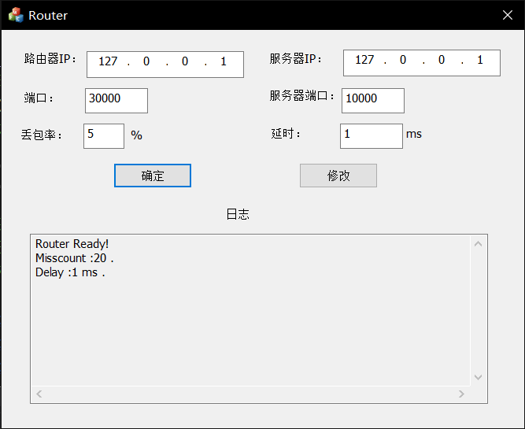

- 丢包率	5%
- 延时	1ms

**建立连接**

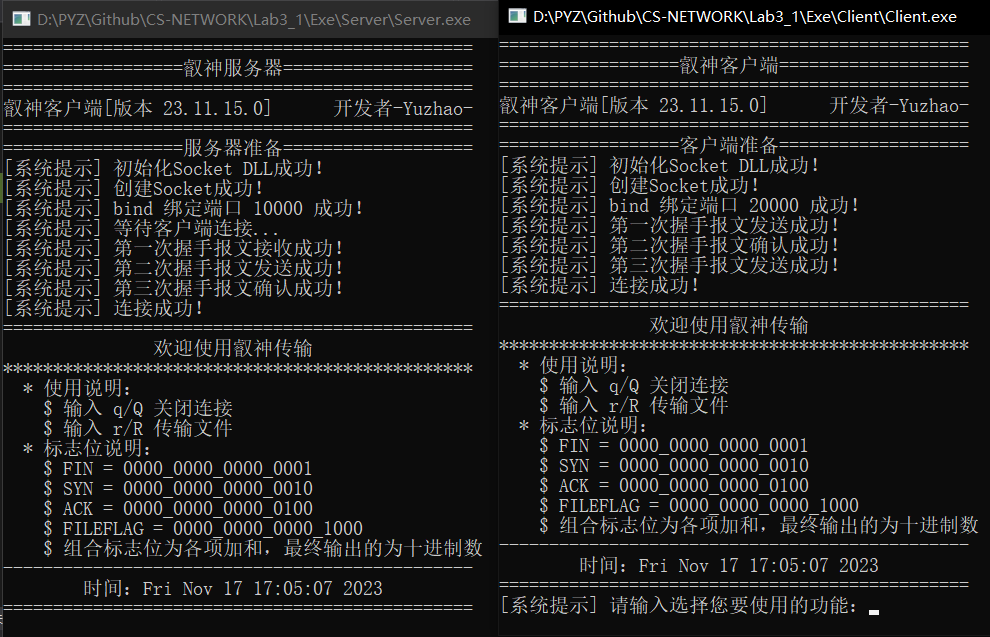

**文件传输**

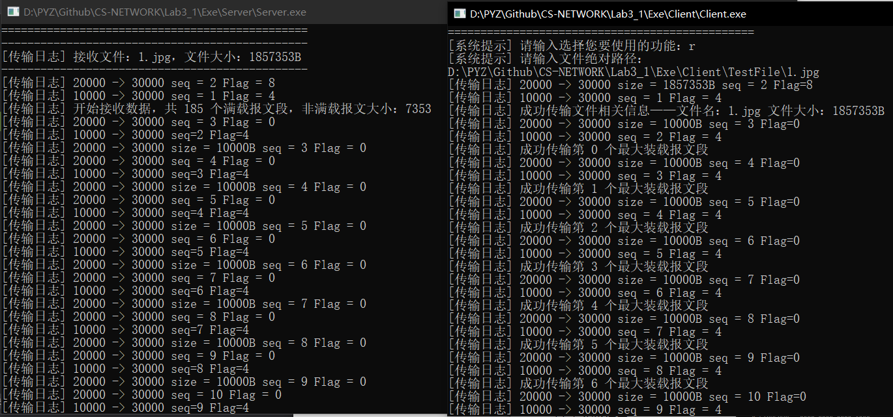

**超时重传**

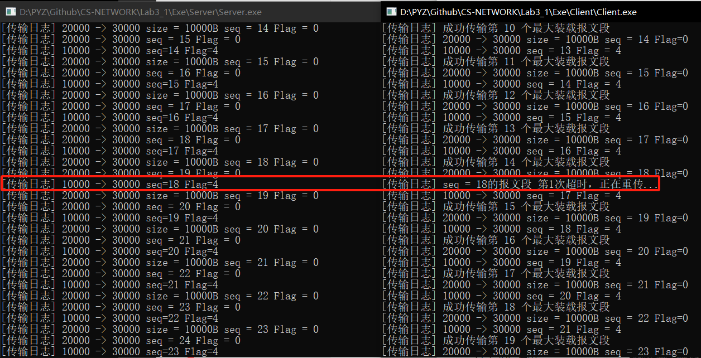

可以看见当出现丢包现象时，我们重传了数据报并且成功按序接收。

**关闭连接**

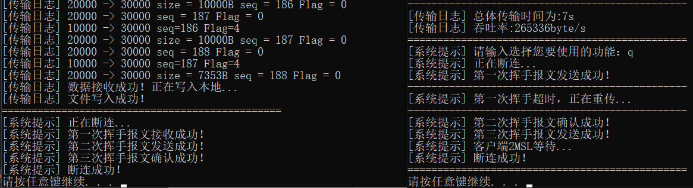

【好巧在这里遇上了挥手阶段的超时重传】

检查可以发现在服务器应用程序的同一级目录下我们成功接收了传输的文件。

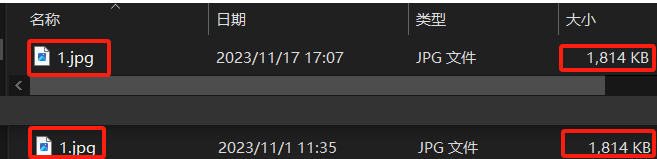

**差错检测**

我们修改了差错检测的处理后，再次实验：

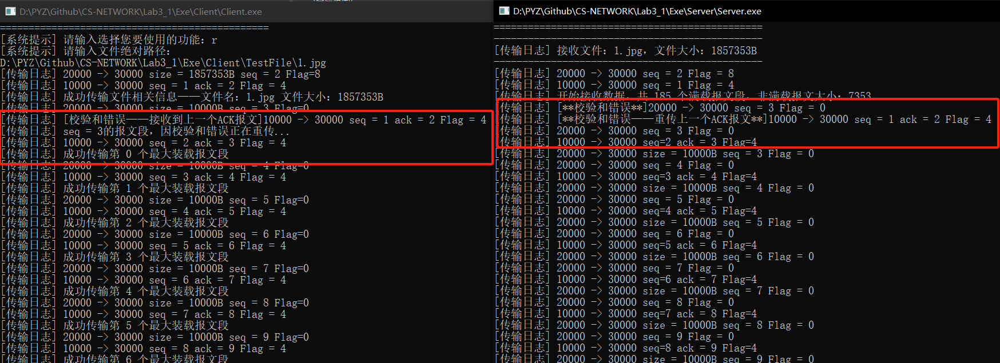

发现成功处理校验和出错问题。

## 五、探索

**1.第三次挥手后为什么要经过TIME_WAIT状态之后才进入CLOSED状态，为什么不直接进入CLOSED状态？**

因为需要确保客户端最后发送第三次挥手的确认报文段数据包被服务器端接收，如果客户端发送的第三次挥手的确认报文段数据包服务端没有收到，那么服务端会重新发送第二次挥手的释放连接报文段数据包，此时客户端处于TIME_WAIT状态，就可以在收到后再次发送第三次挥手的ACK数据包。如果客户端直接关闭连接，将无法处理这种情况，而TIME_WAIT状态一般等待的是2MSL的时长。

**2.可靠数据传输协议——rdt**

1. **rdt1.0：**

   假设底层信道是**完全可靠**的，传输的数据不会损坏或者丢失。

   发送端等待上层传数据传进来，将数据打包为分组并将其发送到信道中。

   接收端收到分组以后，将封包解开，将其发送到上层应用。

2. **rdt2.0：**

   假设底层信道是具有**比特差错**信道。

   发送端等待上层传数据传进来，将数据和检验和打包为分组并将其发送到信道中然后等待，如果接受到ACK则数据无误，回到等待调用状态，如果收到NAK则说明发送的数据有误则进行重传。

   接收端收到数据报，会有ACK(肯定确认)与NAK(否定确认请重传)两种讯息，当数据分组接收到以后确认无误，会发送ACK给发送方已确定数据无误。当发现有错误时，会传回NAK通知发送端重传。

3. **rdt2.1：**

   针对rdt2.0中ACK/NAK受损可能会导致重传的问题，rdt2.1加入了序列号机制(sequence number)，分组的号码可以让发送方知道是否需要重传以及让接收方确认这是否是一次重新传输的分组。

4. **rdt2.2**

   移除NAK的信息，在ACK中加入编号就可以达到确认与否认的效果。发送方必须检查接收到的ACK中的报文中被确认的分组序号。

5. **rdt3.0：**

   rdt3.0假定除了比特受损之外，底层信道还会丢包。为了实现基于时间的重传机制，加入了计时器。

**3.如何判断是否按序传递？**

采用相对序列号，在客户端和服务器程序中均设置初始化为零的同步递增全局变量relative_seq。

**4.recvfrom阻塞**

为了计算延时和吞吐率，我们使用如下代码设置非阻塞：

```C++
u_long mode = 1;
ioctlsocket(clientSocket, FIONBIO, &mode);  // 非阻塞
```

