# <center>计算机网络课程实验报告</center>

## <center>Lab 3-2	基于UDP服务设计可靠传输协议并编程实现（3-2）</center>

<center><b>姓名：彭钰钊 &nbsp&nbsp 学号：2110756 &nbsp&nbsp 专业：计算机科学与技术 </b></center>

## 一、前期准备

### （一）流水线

由于停等机制在每一次发送报文时，都需要等待上个报文的确认报文被接收到，才可以继续发送，因此会产生很长的等待时延，效率低下。而流水线协议则指的是，在确认未返回之前允许发送多个分组，从而提高传输效率。

### （二）滑动窗口流量控制机制

**发送窗口**	在任意时刻，发送方都维持一组连续的允许发送的帧序号，这个组称之为发送窗口。

**接收窗口**	与发送窗口相对应，接收方也在同时维持一组连续的允许接收帧的序号，这个组称之为接收窗口。

**流量控制**	流量控制用于协调发送方和接收方之间的数据传输，以确保在网络中平衡数据流的速率。流量控制的主要目的是防止发送方发送速度过快，导致接收方无法及时处理，从而造成数据丢失或网络拥塞。在滑动窗口机制中，流量控制通过**窗口大小**来实现，当接收窗口向前滑动（并发送确认帧）时，发送窗口才有可能（只有当发送窗口收到确认帧时才会一定）向前滑动。

以**滑动窗口**的视角来看，停等协议、GBN协议和SR协议，三者只有发送窗口和接受窗口的大小区别：

- 停等协议：发送窗口大小=1，接收窗口大小=1
- GBN协议：发送窗口大小>1，接收窗口大小=1【本次实验将要实现的协议】
- SR协议：发送窗口大小>1，接收窗口大小>1

### （三）累积确认

**累积确认（Cumulative Acknowledgment）**	是指接收方向发送方发送一个单一的确认，确认了已成功接收的所有连续数据。在累积确认中，如果接收方成功接收了数据包 N 及之前的所有数据包，那么它只会发送一个确认，表示已经成功接收了这些数据包。在本次实验中由于我们将要实现GBN协议，因此接收窗口大小为1，那么累积确认实际上就是对发送方发来的每一个包进行确认回复。

## 二、协议设计

### （一）报文格式

我们根据UDP数据报报文格式设计我们的协议数据报报文格式如下：


**首部**

- 源ip地址：4字节
- 目的ip地址：4字节（由于我们的实验中是在本地回环中进行数据传输，所以以上两个字段实际上是不需要的）
- 源端口号：2字节
- 目的端口号：2字节
- 发送序列号：4字节
- 确认序列号：4字节
- 数据大小：4字节
- 校验和：2字节
- 标志位：2字节

**数据**

其余MAX_MSG_SIZE大小的字节是数据部分

### （二）建立连接&断开连接

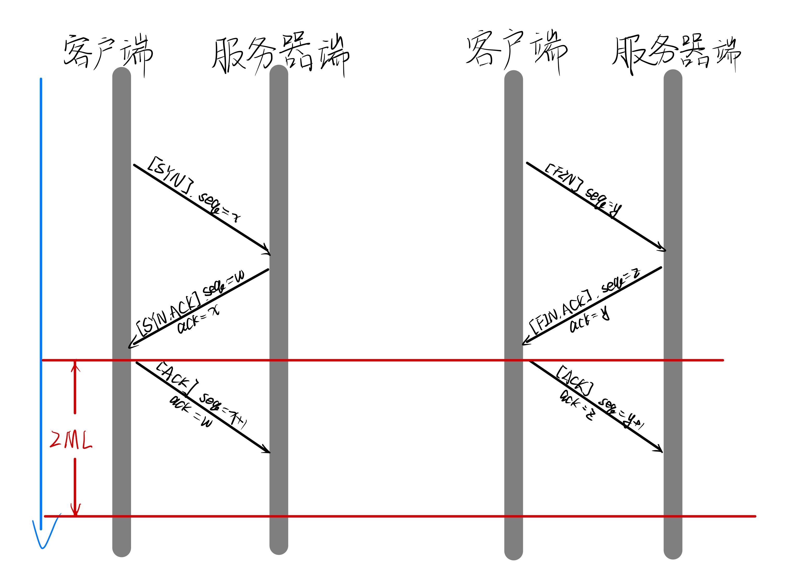

本次实验与3-1采用类似的建立连接和断开连接方式——三次握手&三次挥手，因此不再详细赘述，值得注意的是我们在建立连接的时候采用了等待2MSL的方式防止第三次ACK丢失。

### （三）数据传输

本次实验采用**滑动窗口**来进行流量控制，恢复采用***Go-Back-N（GBN）***，实现了**累积确认**。

#### 滑动窗口

发送窗口示意图如下所示：

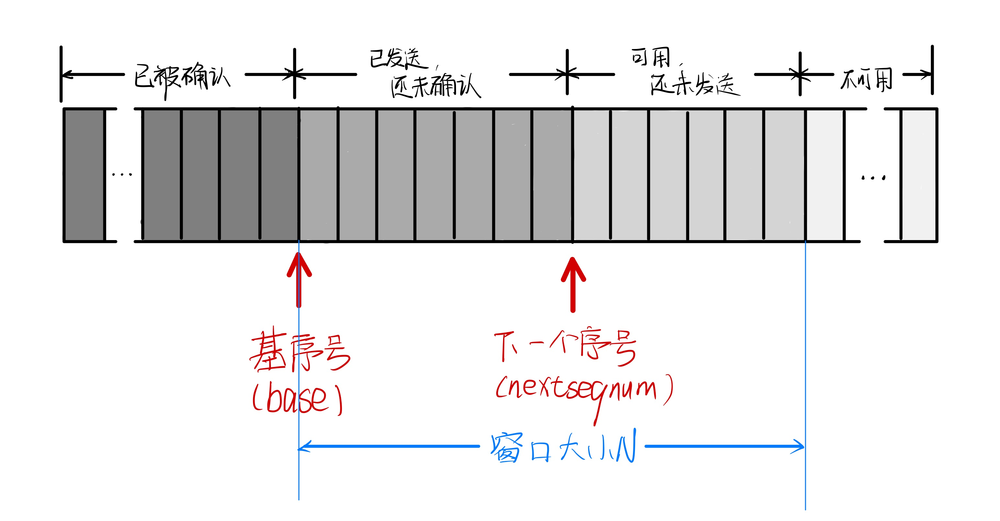

本次实验固定发送窗口大小为**N**，设置两个哨兵指针：**base**和**nextseqnum**，分别代表滑动窗口基序号（滑动窗口开始的位置，指向窗口初始位置，随着发送过程指向已发送但还未确认的第一个序号）和下一个序号。

- **理想情况**

1. 初始状态，***base*** 和 ***nextseqnum*** 都指向第一个序号。 
2. 窗口存在可用且还未发送的数据报，发送端继续发送数据报，***nextseqnum*** 随数据报发送右移，直至窗口中可发送的数据报序号用完。 
3. 发送端收到确认报文，整个窗口右移，即将 ***base*** 右移（移动到当前已经累计确认的最后一个报文）。
4.  当窗口移动后，窗口内存在可用且还未发送的数据报，跳转到步骤2；否则（窗口内不再存在可用且还未发送的数据报）结束。

- **超时重传**

  每一个数据报发送时设置计时器，当超时未收到报文时，会重传当前窗口内所有已经发送的报文，即 ***[base, nextseqnum - 1]***  内的所有报文，此时窗口基序号 ***base*** 和 下一个序号 ***nextseqnum*** 均不发生变化。

- **失序问题**

  **累积确认**解决失序问题。

#### 累积确认

**发送端**

接收ACK确认数据报时，进行判断——***ack***与***base***：

- ***ack < base***：这种情况意味着我们收到了失序ACK确认报文，这是上一个ACK，那么此时窗口不移动。
- ***ack >= base***：这种情况意味着我们收到了正确的ACK确认报文，这是在窗口内的确认报文，那么此时窗口向右移动至基序号为当前确认序列号的下一个位置。

**接收端**

- **理想情况**：接收端每接收到发来的报文，若该报文的序号***等于***接收端期待接收的报文序号，则回复一个确认报文（ack=seq，seq为接收报文的序号），并接收该报文段，将其交付给上层应用。
- **失序**：当接收端收到了***不等于***期待接收的报文序号的报文，则回复一个确认报文，确认号 ack = 接收端累积确认的最后一个报文号（也就是**期待接收的报文序号**的前一个值，ecpectedseqnum - 1），并丢弃该报文段。

#### GBN协议状态机

**发送端**

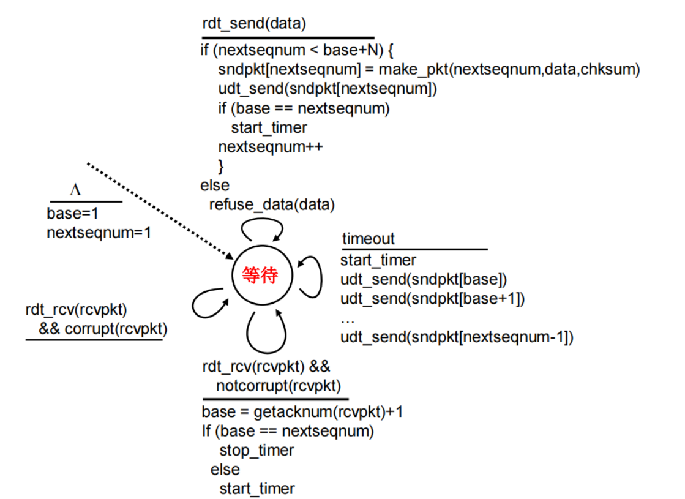

**接收端**

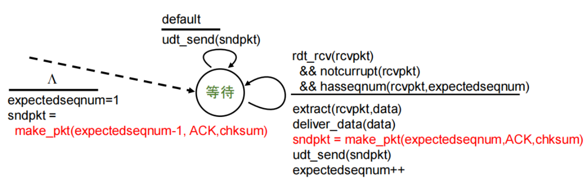

### （五）程序使用

客户端控制是否连接：

- 当客户端接收符号为**q/Q**时断开连接
- 当客户端接受符号**r/R**时建立连接准备传输文件

## 三、功能模块实现与分析

### （一）报文格式、建立连接&断开连接

对于标志位为了方便程序编写，我们在头文件`MessageFormat.h`中使用全局常量的方式设置；并对于一些关于文件传输的常量采取宏定义

```c++
// 宏定义：一些关于文件传输的常量
#define MAX_WAIT_TIME CLOCKS_PER_SEC  // 超时时间上限为1000毫秒
#define MAX_RESEND_TIMES 10  // 超时重传次数上限为10次
#define MAX_FILE_SIZE 100 * 1000000  // 最大文件大小为100兆字节
#define MAX_MSG_SIZE 10000  // 最大文件大小为10000字节

// 定义常量：报文中的标志位
/*
	对于标志位做出特别说明：标志位共16位，现只使用了低四位
	(高位)| Unused | FILEDATA(1 bit) | FILEFLAG(1 bit) | ACK(1 bit) | SYN(1 bit) | FIN(1 bit) |(低位)
	FILEFLAG	表示该包是传输文件相关信息【文件名、文件大小】的数据包
*/
const unsigned short int FIN = 0x1;  // 0000_0000_0000_0001
const unsigned short int SYN = 0x2;  // 0000_0000_0000_0010
const unsigned short int ACK = 0x4;  // 0000_0000_0000_0100
const unsigned short int FILEFLAG = 0x8;  // 0000_0000_0000_1000
const unsigned short int FILEDATA = 0x10;  // 0000_0000_0001_0000
```

在头文件`MessageFormat.h`中设计实现我们的报文格式，报文格式主体使用结构体`MsgFormat`实现。

**校验和**

我们在结构体中定义了校验和的设置函数以及校验函数，其实现逻辑为：

- **发送端	设置校验和**
  - 校验和域段清零【同时填充0】
  - 以16位（2字节）为单位对数据报进行求和运算，注意溢出部分回加
  - 将最终结果（变量低16位）取反填充校验和域段
- **接收端	校验和确认**
  - 以16位（2字节）为单位对数据报进行求和运算，注意溢出部分回加
  - 最终结果（变量低16位）若是全1，则表示未检测到错误，否则说明数据报存在差错
  - 机制解释：由于此时校验和已存在，求和运算实际上是原码+反码，那么正常情况下得到的应该是全1的数据

```c++
// 本部分代码未作修改，与3-1一致
```

**客户端**

```c++
// 建连函数
bool myconnect(SOCKET clientSocket, SOCKADDR_IN serverAddr) {
	int addrlen = sizeof(serverAddr);
	//============================第一次握手===========================
	// SYN = 1, seq = x
	MsgFormat handshake1;  // 第一次握手数据报
	handshake1.SrcPort = ClientPORT;
	handshake1.DestPort = RouterPORT;
	handshake1.seq = connect_seq;
	connect_seq++;
	handshake1.Flag += SYN;
	handshake1.setCheckNum();
	int err = sendto(clientSocket, (char*)&handshake1, sizeof(handshake1), 0, (sockaddr*)&serverAddr, addrlen);
	// cout << "发送handshake1.seq =" << handshake1.seq << "handshake1.ack =" << handshake1.ack << endl;
	clock_t handshake1start = clock();
	if (err == -1) {
		cout << "[错误] 连接失败..." << endl;
		cout << "===============================================" << endl;
		return false;
	}
	cout << "[系统提示] 第一次握手报文发送成功！" << endl;
	//============================第二次握手===========================
	// SYN = 1, ACK = 1, seq = w, ack = x
	MsgFormat handshake2;  // 第二次握手数据报
	while (recvfrom(clientSocket, (char*)&handshake2, sizeof(handshake2), 0, (sockaddr*)&serverAddr, &addrlen) <= 0) {
		//	第一次握手超时，重新发送并重新计时
		if (clock() - handshake1start > MAX_WAIT_TIME) {
			cout << "-----------------------------------------------" << endl;
			cout << "[系统提示] 第一次握手超时，正在重传..." << endl;
			cout << "-----------------------------------------------" << endl;
			err = sendto(clientSocket, (char*)&handshake1, sizeof(handshake1), 0, (sockaddr*)&serverAddr, addrlen);
			handshake1start = clock();
			if (err == -1) {
				cout << "[错误] 连接失败..." << endl;
				cout << "===============================================" << endl;
				return false;
			}
		}
	}
	if ((handshake2.Flag && SYN) && (handshake2.Flag && ACK) && handshake2.check() && (handshake2.ack == handshake1.seq)) {
		// cout << "接收handshake2.seq =" << handshake2.seq << "handshake2.ack =" << handshake2.ack << endl;
		cout << "[系统提示] 第二次握手报文确认成功！" << endl;
	}
	else {
		cout << "[错误] 连接发生错误..." << endl;
		cout << "===============================================" << endl;
		return false;
	}
	//============================第三次握手===========================
	// ACK = 1, seq = x + 1, ack = w
	MsgFormat handshake3;  // 第三次握手数据报
	handshake3.SrcPort = ClientPORT;
	handshake3.DestPort = RouterPORT;
	handshake3.seq = connect_seq;
	connect_seq++;
	handshake3.ack = handshake2.seq;
	handshake3.Flag += ACK;
	handshake3.setCheckNum();
	// cout << "发送handshake3.seq =" << handshake3.seq << "handshake3.ack =" << handshake3.ack << endl;
	err = sendto(clientSocket, (char*)&handshake3, sizeof(handshake3), 0, (sockaddr*)&serverAddr, addrlen);
	clock_t handshake3start = clock();
	if (err == -1) {
		cout << "[错误] 连接失败..." << endl;
		cout << "===============================================" << endl;
		return false;
	}
	cout << "[系统提示] 第三次握手报文发送成功！" << endl;
	// 在上一次报告探索中我说对于TCP而言第三次ACK丢失没什么问题是能够正常发送数据的，但是经过调试发现我的程序并不可以，因此我们仿照四次挥手的处理方式增加以下代码处理重传
	//=======================等待2MSL防止ACK丢失=======================
	int waittime = clock();
	MsgFormat tmp;
	while (clock() - waittime < 2 * MAX_WAIT_TIME) {
		int recvByte = recvfrom(clientSocket, (char*)&tmp, sizeof(tmp), 0, (sockaddr*)&serverAddr, &addrlen);
		if (recvByte == 0) {
			cout << "[系统提示] 连接发生错误..." << endl;
			return false;
		}
		else if (recvByte > 0) {
			sendto(clientSocket, (char*)&handshake3, sizeof(handshake3), 0, (sockaddr*)&serverAddr, addrlen);
			cout << "[系统提示] 重传ACK" << endl;
		}
	}
	cout << "[系统提示] 连接成功！" << endl;
	return true;
}
// 断连函数
bool mydisconnect(SOCKET clientSocket, SOCKADDR_IN serverAddr) {
    // 本部分与建连函数逻辑基本一致，故不再赘述
}
```

**服务器端**

```c++
// 建连函数
bool myconnect(SOCKET serverSocket, SOCKADDR_IN clientAddr) {
	int addrlen = sizeof(clientAddr);
	//============================第一次握手===========================
	// SYN = 1, seq = x
	MsgFormat handshake1;  // 第一次握手数据报
	//============================第二次握手===========================
	// SYN = 1, ACK = 1, seq = w, ack = x
	MsgFormat handshake2;  // 第二次握手数据报
	//============================第三次握手===========================
	// ACK = 1, seq = x + 1, ack = w
	MsgFormat handshake3;  // 第三次握手数据报
	while (1) {
		//============================第一次握手===========================
		int recvByte = recvfrom(serverSocket, (char*)&handshake1, sizeof(handshake1), 0, (sockaddr*)&clientAddr, &addrlen);
		if (recvByte == 0) {
			cout << "[错误] 连接失败..." << endl;
			cout << "===============================================" << endl;
			return false;
		}
		else if (recvByte > 0) {
			if (!(handshake1.Flag && SYN) || !handshake1.check() || !(handshake1.seq == connect_seq)) {
				cout << "[错误] 连接发生错误..." << endl;
				cout << "===============================================" << endl;
				return false;
			}
			// cout << "接收handshake1.seq =" << handshake1.seq << "handshake1.ack =" << handshake1.ack << endl;
			cout << "[系统提示] 第一次握手报文接收成功！" << endl;
			break;
		}
	}
	//============================第二次握手===========================
	handshake2.SrcPort = ServerPORT;
	handshake2.DestPort = RouterPORT;
	handshake2.seq = connect_seq;
	connect_seq++;
	handshake2.ack = handshake1.seq;
	handshake2.Flag += SYN;
	handshake2.Flag += ACK;
	handshake2.setCheckNum();
	int err = sendto(serverSocket, (char*)&handshake2, sizeof(handshake2), 0, (sockaddr*)&clientAddr, addrlen);
	// cout << "发送handshake2.seq =" << handshake2.seq << "handshake2.ack =" << handshake2.ack << endl;
	clock_t handshake2start = clock();
	if (err == -1) {
		cout << "[错误] 连接失败..." << endl;
		cout << "===============================================" << endl;
		return false;
	}
	cout << "[系统提示] 第二次握手报文发送成功！" << endl;
	//============================第三次握手===========================
	while (recvfrom(serverSocket, (char*)&handshake3, sizeof(handshake3), 0, (sockaddr*)&clientAddr, &addrlen) <= 0) {
		//	第二次握手超时，重新发送并重新计时
		if (clock() - handshake2start > MAX_WAIT_TIME) {
			cout << "-----------------------------------------------" << endl;
			cout << "[系统提示] 第二次握手超时，正在重传..." << endl;
			cout << "-----------------------------------------------" << endl;
			err = sendto(serverSocket, (char*)&handshake2, sizeof(handshake2), 0, (sockaddr*)&clientAddr, addrlen);
			handshake2start = clock();
			if (err == -1) {
				cout << "[错误] 连接失败..." << endl;
				cout << "===============================================" << endl;
				return false;
			}
		}
	}
	if ((handshake3.Flag && ACK) && handshake3.check() && (handshake3.ack == handshake2.seq) && (handshake3.seq == connect_seq)) {
		// cout << "接收handshake3.seq =" << handshake3.seq << "handshake3.ack =" << handshake3.ack << endl;
		cout << "[系统提示] 第三次握手报文确认成功！" << endl;
		cout << "[系统提示] 连接成功！" << endl;
		return true;
	}
	else {
		cout << "[错误] 连接发生错误..." << endl;
		cout << "===============================================" << endl;
		return false;
	}
}
// 断连函数
bool mydisconnect(SOCKET serverSocket, SOCKADDR_IN clientAddr) {
    // 本部分与建连函数逻辑基本一致，故不再赘述
}
```

### （二）数据传输

**客户端**

**多线程处理**

- 两个线程共享数据

  - `int base`：基序号
  - `int nextseqnum`：下一个序号
  - `clock_t time_count`：计时器
  - `bool over`：结束标记

- 主线程：发送数据

  持续循环发送数据报：

  - 当 ***nextseqnum < base + N*** 时，表示窗口内有可发送数据报，那么此时发送数据报，并且右移 ***nextseqnum***。

  - **超时重传**：

    重传***[base, nextseqnum - 1]*** 内的所有报文，并重新计时。

- 辅助函数线程：接收ACK

  持续循环接收数据报：

  - 接收到ACK：
    - ***ack < base***，不做操作
    - ***ack >= base***，使 ***base = ack + 1***
  - 接收到最后一个报文，标记 **over=true**

```c++
// 报文传输辅助函数——接收线程
struct parameters {
	SOCKADDR_IN serverAddr;
	SOCKET clientSocket;
	int pkt_amount;  // 报文总数：相对序列号不会比这个大
};
DWORD WINAPI ACKRecvThread(PVOID pParam) {
	parameters* para = (parameters*)pParam;
	SOCKADDR_IN serverAddr = para->serverAddr;
	SOCKET clientSocket = para->clientSocket;
	int pkt_amount = para->pkt_amount;
	int addrlen = sizeof(serverAddr);
	
	while (1) {
		MsgFormat recvMsg;
		int recvByte = recvfrom(clientSocket, (char*)&recvMsg, sizeof(recvMsg), 0, (sockaddr*)&serverAddr, &addrlen);
		lock_guard<mutex> lock(outputMutex);  // 加锁
		if (recvByte > 0) {  // 成功收到消息【不管是啥，收到东西了】
			if ((recvMsg.Flag && ACK) && recvMsg.check()) {  // 检查校验和
				// 注意：为了防止错误的左移滑动窗口【失序报文ACK返回】，我们需要确保当前的ack是在[base, nextseqnum - 1]内的
				if (recvMsg.ack < base);
				else
					base = recvMsg.ack + 1;  // 滑动窗口滑动
				if (base != nextseqnum)
					time_count = clock();  // 更新时间
				cout << "[传输日志] " << recvMsg.SrcPort << " -> " << recvMsg.DestPort << " ack = " << recvMsg.ack << " Flag = " << recvMsg.Flag << endl;
				if (base + N < pkt_amount) {  // 展示窗口情况
					cout << "[传输日志] [接收ACK]当前窗口情况——窗口总大小：" << N << "，已发送但未收到ACK的数据报数目：" << nextseqnum - base << "，窗口内尚未发送数据报数目：" << N - (nextseqnum - base) << endl;
				}
				else {// 展示窗口情况
					cout << "[传输日志] [接收ACK]当前窗口情况——窗口总大小：" << N << "，已发送但未收到ACK的数据报数目：" << nextseqnum - base << "，窗口内尚未发送数据报数目：" << pkt_amount - base - (nextseqnum - base) << endl;
				}
				// 判断传输结束
				if (recvMsg.ack == pkt_amount - 1) {
					cout << "[传输日志] **********传输结束！**********" << endl;
					over = true;
					return 0;
				}
			}
		}
	}
	return 0;
}
// 报文传输函数
void GBN_SendFunc(string path, SOCKET clientSocket, SOCKADDR_IN serverAddr) {
	int addrlen = sizeof(serverAddr);
	clock_t startTime = clock();
	string filename = "";
	for (int i = path.size() - 1; i >= 0; i--) {  // 逆序获取逆序文件名
		if (path[i] == '/' || path[i] == '\\')
			break;
		filename += path[i];
	}
	filename = string(filename.rbegin(), filename.rend());  // 逆序获取正序文件名
	ifstream f(path.c_str(), ifstream::binary);  // 以二进制方式读取文件
	if (!f) {
		cout << "[传输日志] 无法打开文件..." << endl;
		return;
	}
	BYTE* fileBuffer = new BYTE[MAX_FILE_SIZE];
	unsigned int fileSize = 0;
	BYTE byte = f.get();
	while (f) {  // 将文件读取到缓冲区
		fileBuffer[fileSize++] = byte;
		byte = f.get();
	}
	f.close();

	int batchNum = fileSize / MAX_MSG_SIZE;  // 满载报文数
	int leftSize = fileSize % MAX_MSG_SIZE;  // 剩余报文大小

	//=========================创建接受消息线程========================
	int pkt_amount = leftSize > 0 ? batchNum + 2 : batchNum + 1;  // +1是由于第一个文件名字及大小的包占一个
	parameters param;
	param.serverAddr = serverAddr;
	param.clientSocket = clientSocket;
	param.pkt_amount = pkt_amount;
	HANDLE hThread = CreateThread(NULL, 0, (LPTHREAD_START_ROUTINE)ACKRecvThread, &param, 0, 0);
	//===========================主线程：发送==========================
	MsgFormat sendMsg;
	while (1) {
		lock_guard<mutex> lock(outputMutex);  // 加锁
		if (nextseqnum < base + N && nextseqnum < pkt_amount) {
			if (nextseqnum == 0) {  // 文件名字及大小
				sendMsg.SrcPort = ClientPORT;
				sendMsg.DestPort = RouterPORT;
				sendMsg.size = fileSize;
				sendMsg.Flag += FILEFLAG;
				sendMsg.seq = nextseqnum;
				for (int i = 0; i < filename.size(); i++)  // 填充报文数据段
				sendMsg.MSGDataBuf[i] = filename[i];
				sendMsg.MSGDataBuf[filename.size()] = '\0';//字符串结尾补\0
				sendMsg.setCheckNum();
			}
			else if (nextseqnum == batchNum + 1 && leftSize > 0) {  // 剩余数据
				sendMsg.SrcPort = ClientPORT;
				sendMsg.DestPort = RouterPORT;
				sendMsg.size = leftSize;
				sendMsg.Flag = FILEDATA;
				sendMsg.seq = nextseqnum;
				for (int j = 0; j < leftSize; j++) {
					sendMsg.MSGDataBuf[j] = fileBuffer[batchNum * MAX_MSG_SIZE + j];
				}
				sendMsg.setCheckNum();
			}
			else {
				sendMsg.SrcPort = ClientPORT;
				sendMsg.DestPort = RouterPORT;
				sendMsg.size = MAX_MSG_SIZE;
				sendMsg.Flag = FILEDATA;
				sendMsg.seq = nextseqnum;
				for (int j = 0; j < MAX_MSG_SIZE; j++) {
					sendMsg.MSGDataBuf[j] = fileBuffer[(nextseqnum - 1) * MAX_MSG_SIZE + j];
				}
				sendMsg.setCheckNum();
			}
			// 发送
			sendto(clientSocket, (char*)&sendMsg, sizeof(sendMsg), 0, (sockaddr*)&serverAddr, addrlen);
			cout << "[传输日志] " << sendMsg.SrcPort << " -> " << sendMsg.DestPort << " size = " << sendMsg.size << "B seq = " << sendMsg.seq << " Flag = " << sendMsg.Flag << endl;
			if (base == nextseqnum) {
				time_count = clock();
			}
			nextseqnum++;
			if (base + N < pkt_amount) {  // 展示窗口情况
				cout << "[传输日志] [发送数据报]当前窗口情况——窗口总大小：" << N << "，已发送但未收到ACK的数据报数目：" << nextseqnum - base << "，窗口内尚未发送数据报数目：" << N - (nextseqnum - base) << endl;
			}
			else {// 展示窗口情况
				cout << "[传输日志] [发送数据报]当前窗口情况——窗口总大小：" << N << "，已发送但未收到ACK的数据报数目：" << nextseqnum - base << "，窗口内尚未发送数据报数目：" << pkt_amount - base - (nextseqnum - base) << endl;
			}
		}
		// 超时重传
		if (clock() - time_count > MAX_WAIT_TIME) {  // GBN——当前窗口内的所有数据报重传
			for (int i = 0; i < nextseqnum - base; i++) {
				int send_seq = base + i;
				if (send_seq == 0) {
					sendMsg.SrcPort = ClientPORT;
					sendMsg.DestPort = RouterPORT;
					sendMsg.size = fileSize;
					sendMsg.Flag += FILEFLAG;
					sendMsg.seq = send_seq;
					for (int i = 0; i < filename.size(); i++)  // 填充报文数据段
						sendMsg.MSGDataBuf[i] = filename[i];
					sendMsg.MSGDataBuf[filename.size()] = '\0';//字符串结尾补\0
					sendMsg.setCheckNum();
					cout << "[传输日志] 传输文件相关信息——文件名：" << filename << " 文件大小：" << fileSize << "B" << endl;
				}
				else if (send_seq == batchNum + 1 && leftSize > 0) {
					sendMsg.SrcPort = ClientPORT;
					sendMsg.DestPort = RouterPORT;
					sendMsg.size = leftSize;
					sendMsg.Flag = FILEDATA;
					sendMsg.seq = send_seq;
					for (int j = 0; j < leftSize; j++) {
						sendMsg.MSGDataBuf[j] = fileBuffer[batchNum * MAX_MSG_SIZE + j];
					}
					sendMsg.setCheckNum();
				}
				else {
					sendMsg.SrcPort = ClientPORT;
					sendMsg.DestPort = RouterPORT;
					sendMsg.size = MAX_MSG_SIZE;
					sendMsg.Flag = FILEDATA;
					sendMsg.seq = send_seq;
					for (int j = 0; j < MAX_MSG_SIZE; j++) {
						sendMsg.MSGDataBuf[j] = fileBuffer[(send_seq - 1) * MAX_MSG_SIZE + j];
					}
					sendMsg.setCheckNum();
				}
				// 发送
				sendto(clientSocket, (char*)&sendMsg, sizeof(sendMsg), 0, (sockaddr*)&serverAddr, addrlen);
				cout << "[传输日志] seq = " << sendMsg.seq << "的报文段超时，正在重传..." << endl;
			}
			time_count = clock();
		}
		if (over == true) break;  // 已收到所有ACK
	}
	CloseHandle(hThread);
	cout << "[传输日志] 已发送并确认所有报文，文件传输成功！" << endl;
	clock_t endTime = clock();
	cout << "-----------------------------------------------" << endl;
	cout << "[传输日志] 总体传输时间为:" << (endTime - startTime) / CLOCKS_PER_SEC << "s" << endl;
	cout << "[传输日志] 吞吐率:" << ((float)fileSize) / ((endTime - startTime) / CLOCKS_PER_SEC) << "byte/s" << endl;
	cout << "===============================================" << endl;
	return;
}
```

**服务器端**

整体与上一次实验相似，但是引入了变量***expectedseqnum***。

```c++
// 报文接收辅助函数
bool msgRecv(MsgFormat& recvMsg, SOCKET serverSocket, SOCKADDR_IN clientAddr, int& expectedseqnum) {
	int addrlen = sizeof(clientAddr);
	while (1) {
		int recvByte = recvfrom(serverSocket, (char*)&recvMsg, sizeof(recvMsg), 0, (sockaddr*)&clientAddr, &addrlen);
		if (recvByte > 0) {
			if (recvMsg.check() && ((recvMsg.seq == expectedseqnum))) {
				MsgFormat ackMsg;
				ackMsg.SrcPort = ServerPORT;
				ackMsg.DestPort = RouterPORT;
				ackMsg.Flag += ACK;
				ackMsg.ack = recvMsg.seq;
				ackMsg.setCheckNum();
				sendto(serverSocket, (char*)&ackMsg, sizeof(ackMsg), 0, (sockaddr*)&clientAddr, addrlen);
				cout << "[传输日志] " << recvMsg.SrcPort << " -> " << recvMsg.DestPort << " seq = " << recvMsg.seq << " Flag = " << recvMsg.Flag << endl;
				cout << "[传输日志] " << ackMsg.SrcPort << " -> " << ackMsg.DestPort << " ack = " << ackMsg.ack << " Flag = " << ackMsg.Flag << endl;
				expectedseqnum++;
				return true;
			}
			// 如果 seq != expectedseqnum，返回累计确认的ACK（expectedseqnum - 1）
			else if (recvMsg.check() && ((recvMsg.seq != expectedseqnum))) {
				MsgFormat ackMsg;
				ackMsg.SrcPort = ServerPORT;
				ackMsg.DestPort = RouterPORT;
				ackMsg.Flag += ACK;
				ackMsg.ack = expectedseqnum - 1;
				ackMsg.setCheckNum();
				sendto(serverSocket, (char*)&ackMsg, sizeof(ackMsg), 0, (sockaddr*)&clientAddr, addrlen);
				cout << "[传输日志] [累计确认（失序）]" << recvMsg.SrcPort << " -> " << recvMsg.DestPort << " seq = " << recvMsg.seq << " Flag = " << recvMsg.Flag << endl;
				cout << "[传输日志] " << ackMsg.SrcPort << " -> " << ackMsg.DestPort << " ack = " << ackMsg.ack << " Flag = " << ackMsg.Flag << endl;
			}
		}
		else if (recvByte == 0) {
			return false;
		}
	}
}
// 报文接收函数
void RecvFunc(SOCKET serverSocket, SOCKADDR_IN clientAddr) {
	int expectedseqnum = 0;  // 期待接收的序列号
	int addrlen = sizeof(clientAddr);
	//
	int expected_seq = 0;
	//===========================文件名和大小==========================
	MsgFormat rMsg;
	unsigned int filesize;
	char filename[50] = { 0 };
	while (1) {
		int recvByte = recvfrom(serverSocket, (char*)&rMsg, sizeof(rMsg), 0, (sockaddr*)&clientAddr, &addrlen);
		if (recvByte > 0) {
			if (rMsg.check() && ((rMsg.seq == expectedseqnum))) {
				filesize = rMsg.size;  // 获取文件大小
				for (int i = 0; rMsg.MSGDataBuf[i]; i++)  // 获取文件名
					filename[i] = rMsg.MSGDataBuf[i];
				cout << "-----------------------------------------------" << endl;
				cout << "[传输日志] 接收文件：" << filename << "，文件大小：" << filesize << "B" << endl;
				cout << "-----------------------------------------------" << endl;
				MsgFormat ackMsg;
				ackMsg.SrcPort = ServerPORT;
				ackMsg.DestPort = RouterPORT;
				ackMsg.Flag += ACK;
				ackMsg.ack = rMsg.seq;
				ackMsg.setCheckNum();
				sendto(serverSocket, (char*)&ackMsg, sizeof(ackMsg), 0, (sockaddr*)&clientAddr, addrlen);
				cout << "[传输日志] " << rMsg.SrcPort << " -> " << rMsg.DestPort << " seq = " << rMsg.seq << " Flag = " << rMsg.Flag << endl;
				cout << "[传输日志] " << ackMsg.SrcPort << " -> " << ackMsg.DestPort << " ack = " << ackMsg.ack << " Flag = " << ackMsg.Flag << endl;
				expectedseqnum++;
				break;
			}
			// 如果 seq != expectedseqnum，返回累计确认的ACK（expectedseqnum - 1）
			else if (rMsg.check() && ((rMsg.seq != expectedseqnum))) {
				MsgFormat ackMsg;
				ackMsg.SrcPort = ServerPORT;
				ackMsg.DestPort = RouterPORT;
				ackMsg.Flag += ACK;
				ackMsg.ack = expectedseqnum - 1;
				ackMsg.setCheckNum();
				sendto(serverSocket, (char*)&ackMsg, sizeof(ackMsg), 0, (sockaddr*)&clientAddr, addrlen);
				cout << "[传输日志] [累计确认（失序）]" << rMsg.SrcPort << " -> " << rMsg.DestPort << " seq = " << rMsg.seq << " Flag = " << rMsg.Flag << endl;
				cout << "[传输日志] " << ackMsg.SrcPort << " -> " << ackMsg.DestPort << " ack = " << ackMsg.ack << " Flag = " << ackMsg.Flag << endl;
			}
		}
	}
	//===========================文件数据部分==========================
	int batchNum = filesize / MAX_MSG_SIZE;  // 满载报文数
	int leftSize = filesize % MAX_MSG_SIZE;  // 剩余报文大小
	BYTE* fileBuffer = new BYTE[filesize];
	cout << "[传输日志] 开始接收数据，共 " << batchNum << " 个满载报文段，非满载报文大小：" << leftSize << endl;
	for (int i = 0; i < batchNum; i++) {  // i + 1 - 第几个满载报文
		MsgFormat dMsg;
		if (msgRecv(dMsg, serverSocket, clientAddr, expectedseqnum))
			cout << "[传输日志] " << dMsg.SrcPort << " -> " << dMsg.DestPort << " size = " << dMsg.size << "B seq = " << dMsg.seq << " Flag = " << dMsg.Flag << endl;
		else {
			cout << "[传输日志] 数据接收失败..." << endl;
			cout << "===============================================" << endl;
			return;
		}
		for (int j = 0; j < MAX_MSG_SIZE; j++) {  // 读取数据部分
			fileBuffer[i * MAX_MSG_SIZE + j] = dMsg.MSGDataBuf[j];
		}
	}
	if (leftSize > 0) {
		MsgFormat dMsg;
		if (msgRecv(dMsg, serverSocket, clientAddr, expectedseqnum))
			cout << "[传输日志] " << dMsg.SrcPort << " -> " << dMsg.DestPort << " size = " << dMsg.size << "B seq = " << dMsg.seq << " Flag = " << dMsg.Flag << endl;
		else {
			cout << "[传输日志] 数据接收失败..." << endl;
			cout << "===============================================" << endl;
			return;
		}
		for (int j = 0; j < leftSize; j++) {
			fileBuffer[batchNum * MAX_MSG_SIZE + j] = dMsg.MSGDataBuf[j];
		}
	}
	cout << "[传输日志] 数据接收成功！正在写入本地..." << endl;
	ofstream f(filename, ofstream::binary);  // 以二进制方式读取文件
	if (f.is_open()) {
		f.write(reinterpret_cast<const char*>(fileBuffer), filesize);
		f.close();
		cout << "[传输日志] 文件写入成功！" << endl;
		cout << "===============================================" << endl;
	}
}
```

### （三）程序使用

**客户端**

```c++
while (res) {  // res是建连返回值
		char c;
		if (run_flag) {
			run_flag = 0;
			cout << "[系统提示] 请输入选择您要使用的功能：";
		}
		else {
			cout << "[系统提示] 请输入 q/Q 关闭连接：";
		}
		cin >> c;
		if (c == 'r' || c == 'R')
		{
			string filepath;
			cout << "[系统提示] 请输入文件绝对路径：" << endl;
			cin >> filepath;
			//=============================文件传输============================
			GBN_SendFunc(filepath, clientSocket, serverAddr);
		}
		else if (c == 'q' || c == 'Q')
		{
			res = false;  // 退出循环
		}
	}
```

## 四、程序运行演示

**路由器设置**

- 丢包率：3%
- 延时：1ms

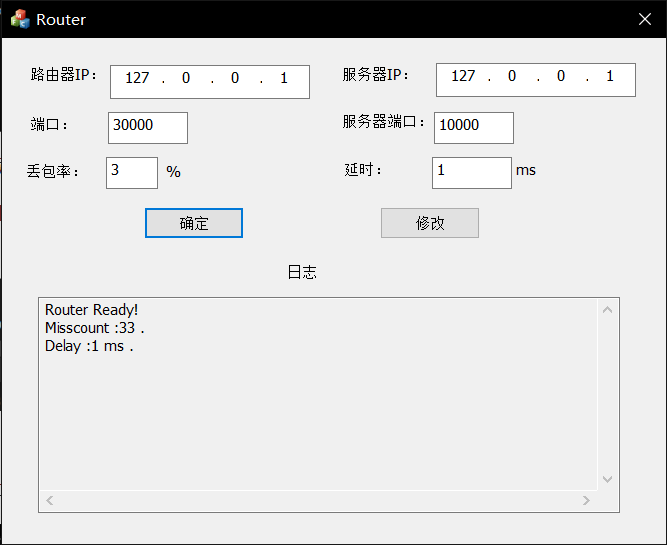

**建立连接**

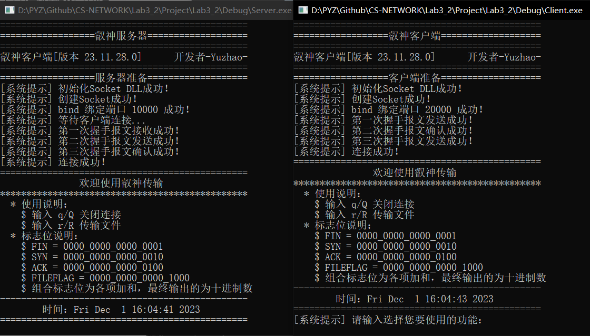

**关闭连接**

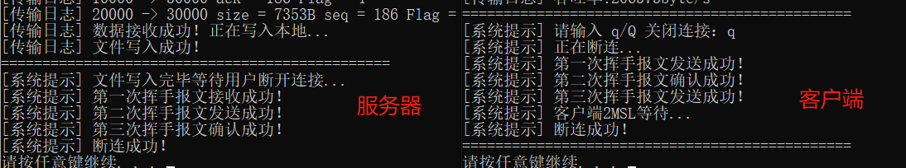

**文件传输**

- **流水线发送**

  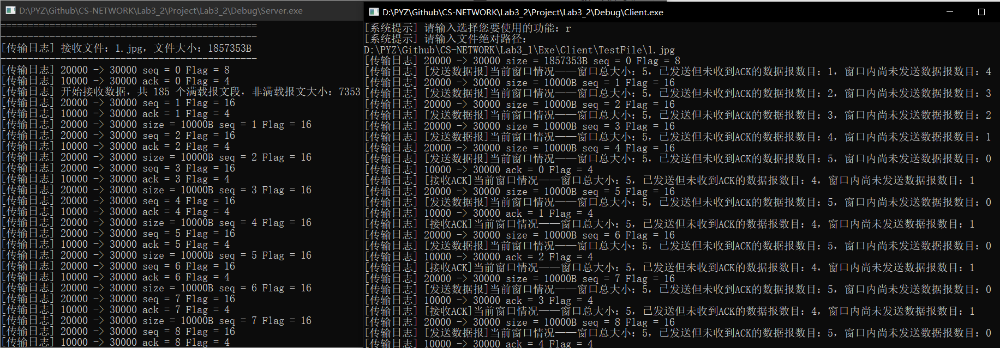

- **累积确认**

  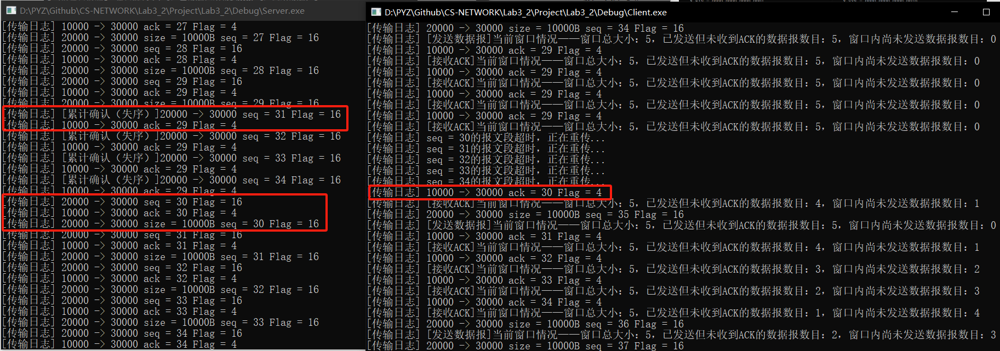

**传输结果**

以第一个文件为例


**数据分析**

- **固定窗口大小为5，分析不同文件的传输时间和吞吐率**

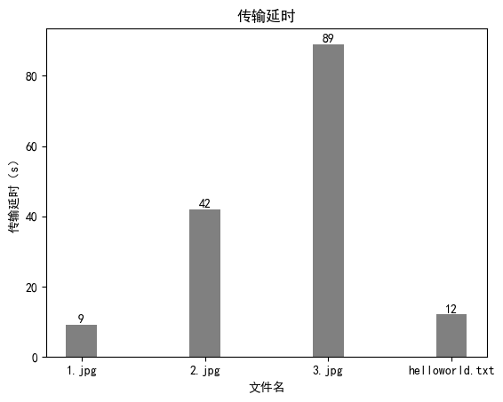

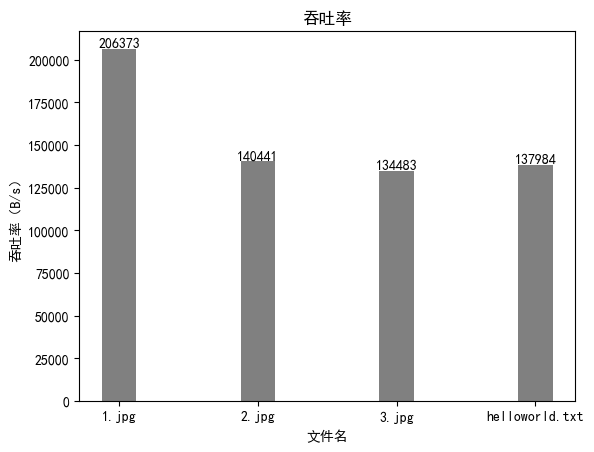

****

- **以1.jpg为例分析不同窗口大小的传输时间和吞吐率**

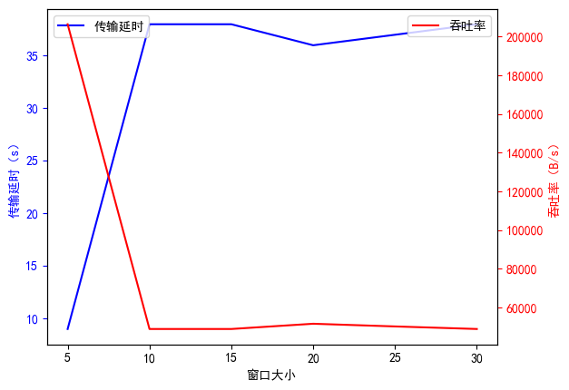

